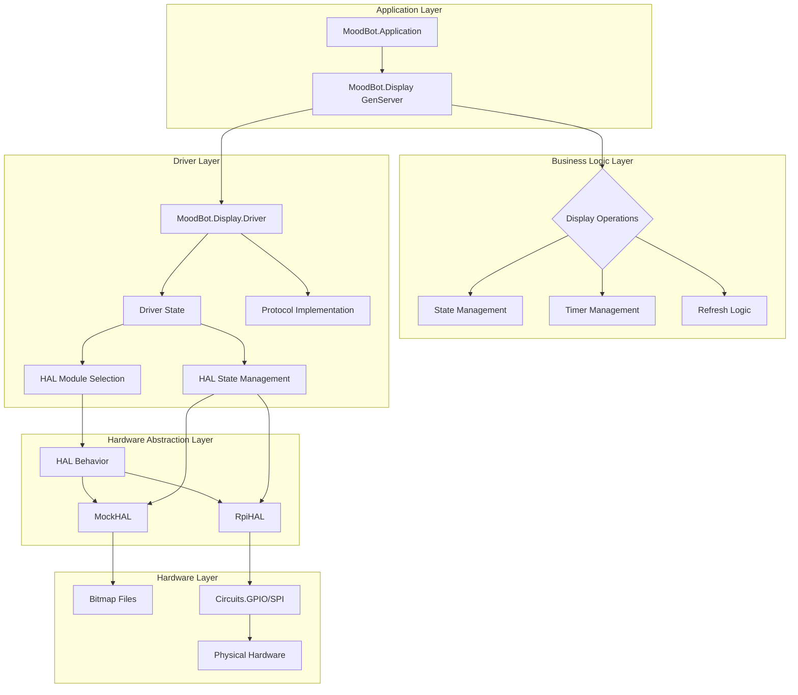

# Design Document: Display-Driver-HAL Architecture Refactoring

## Overview

This design refactors the display subsystem to establish proper separation of concerns with a clean `Display → Driver → HAL` dependency chain. The refactoring moves HAL ownership from Display to Driver, creating three distinct layers: Display (GenServer business logic), Driver (protocol implementation with HAL ownership), and HAL (hardware abstraction interface).

The design leverages existing patterns extensively while establishing cleaner architectural boundaries. All public APIs remain unchanged to ensure backward compatibility.

## Code Reuse Analysis

**Existing Patterns to Leverage:**

- **TypedStruct State Management**: Both MockHAL and RpiHAL use TypedStruct for structured state - Driver will adopt this pattern
- **HAL Behavior Pattern**: Well-established behavior contract with init/close lifecycle - Driver will manage this lifecycle  
- **GenServer Patterns**: Display module's state management, error handling, and timer patterns remain unchanged
- **Mix.target() Logic**: Current HAL selection logic moves from Display to Driver
- **Error Tuple Patterns**: Consistent `{:ok, state} | {:error, reason}` patterns throughout codebase
- **Configuration Loading**: Existing config/target.exs and config/host.exs patterns preserved
- **Test Infrastructure**: DisplayTestHelper.TestHAL pattern will be adapted for Driver testing

**Integration Points:**

- Display.status/1 will extract hal_module from driver_state for debugging continuity  
- Application.ex supervision tree registration unchanged
- All public Display API signatures preserved exactly
- Configuration format compatibility maintained with graceful hal_module handling

## Steering Document Alignment

### Technical Standards (tech.md)

- **HAL Pattern Compliance**: Establishes proper "GenServer → Driver → HAL Interface → Implementation" flow as documented
- **State Machine Patterns**: Preserves Display's manual state tracking with validation-before-action approach
- **Error Handling Standards**: Maintains consistent error tuple patterns and graceful degradation
- **Target-Conditional Logic**: Moves Mix.target() HAL selection to appropriate layer (Driver)
- **OTP Supervision**: Preserves robust GenServer patterns for fault tolerance

### Project Structure (structure.md)

- **HAL Pattern Organization**: Follows documented HAL pattern structure with proper component roles
- **Module Naming**: Maintains established MoodBot.Display.* namespace and naming conventions
- **File Organization**: No changes to file locations, preserving structure.md conventions
- **Test Structure**: Mirrors lib/ structure in test/ organization as documented
- **Configuration Structure**: Preserves config/host.exs vs config/target.exs pattern

## Architecture

The refactored architecture establishes clear layer responsibilities and unidirectional dependencies:



**Dependency Flow:**

1. Display calls Driver functions with driver_state
2. Driver manages HAL lifecycle and delegates to HAL implementations  
3. HAL implementations abstract hardware operations
4. Driver aggregates HAL results and returns updated driver_state to Display

## Components and Interfaces

### MoodBot.Display (GenServer) - Business Logic Layer

**Purpose:** High-level state management, timing logic, and public API

**Existing Interfaces Preserved:**

- `start_link/1` - GenServer initialization
- `init_display/1` - Initialize display hardware
- `show_mood/2` - Display mood indicators  
- `clear/1`, `fill_black/1` - Display operations
- `display_image/2` - Custom image display
- `sleep/1` - Power management
- `status/1` - System status for debugging

**Internal State Changes:**

```elixir
# REMOVE: hal_module, hal_state fields
# ADD: driver_state field
defstruct [
  :driver_state,        # NEW: Single driver state 
  :config,              # UNCHANGED
  :display_state,       # UNCHANGED  
  initialized?: false,  # UNCHANGED
  # ... rest unchanged
]
```

**Dependencies:** Driver module only (no direct HAL access)

### MoodBot.Display.Driver - Protocol Implementation Layer  

**Purpose:** Hardware protocol implementation with HAL lifecycle ownership

**New Unified Interface:**

```elixir
@spec init(config :: map()) :: {:ok, driver_state()} | {:error, term()}
@spec display_frame_full(driver_state(), binary()) :: {:ok, driver_state()} | {:error, term()}  
@spec display_frame_partial(driver_state(), binary()) :: {:ok, driver_state()} | {:error, term()}
@spec clear_display(driver_state(), binary()) :: {:ok, driver_state()} | {:error, term()}
@spec sleep(driver_state()) :: {:ok, driver_state()} | {:error, term()}
@spec close(driver_state()) :: :ok
# ... all other functions updated similarly
```

**Driver State Structure:**

```elixir
use TypedStruct

typedstruct do
  field(:hal_module, module())                    # MockHAL | RpiHAL
  field(:hal_state, HAL.hal_state())             # HAL-specific state
  field(:initialized?, boolean(), default: false) # Initialization tracking
end
```

**HAL Selection Logic:**

```elixir
defp select_hal_module() do
  if Mix.target() == :host do
    MoodBot.Display.MockHAL
  else  
    MoodBot.Display.RpiHAL
  end
end
```

**Dependencies:** HAL behavior and implementations

### HAL Layer (Unchanged)

**Purpose:** Hardware abstraction interface - no changes required

**Interfaces:** All existing HAL functions remain identical

- `init/1`, `spi_write/2`, `gpio_set_dc/2`, `gpio_set_rst/2`, `gpio_read_busy/1`, `close/1`, `sleep/1`

**Implementations:** MockHAL and RpiHAL remain unchanged

## Data Models

### Driver State

```elixir
@type driver_state :: %MoodBot.Display.Driver{
  hal_module: MockHAL | RpiHAL,
  hal_state: MockHAL.t() | RpiHAL.t(),
  initialized?: boolean()
}
```

### Display State (Modified)

```elixir  
# REMOVE these fields:
# :hal_module, :hal_state

# ADD this field:
defstruct [
  :driver_state,              # NEW: Driver state container
  :config,                    # UNCHANGED
  :display_state,             # UNCHANGED
  initialized?: false,        # UNCHANGED
  refresh_state: :idle_and_ready, # UNCHANGED
  # ... all other fields unchanged
]
```

### Configuration Model (Enhanced)

```elixir
@type config :: %{
  spi_device: String.t(),
  dc_gpio: Circuits.GPIO.gpio_spec(),
  rst_gpio: Circuits.GPIO.gpio_spec(), 
  busy_gpio: Circuits.GPIO.gpio_spec(),
  pwr_gpio: Circuits.GPIO.gpio_spec(),
  # hal_module field becomes optional/ignored - Driver selects internally
  hal_module: module() | nil  # Optional for backward compatibility
}
```

## Error Handling

### Error Propagation Chain

1. **HAL Errors** → Driver catches and wraps with context
2. **Driver Errors** → Display receives and handles appropriately  
3. **Display Errors** → Application level receives final error tuples

### Error Scenarios

**Scenario 1: HAL Initialization Failure**

- **Handling:** Driver.init/1 catches HAL init errors, logs with context, returns `{:error, {:hal_init_failed, reason}}`
- **Display Impact:** Display transitions to :error state, preserves error for status/1
- **User Impact:** Clear error message indicating hardware initialization failure

**Scenario 2: SPI Communication Failure**

- **Handling:** Driver catches HAL SPI errors, attempts recovery if appropriate, returns `{:error, {:spi_failed, reason}}`
- **Display Impact:** Display operation fails gracefully, state remains consistent  
- **User Impact:** Operation-specific error message with retry suggestion

**Scenario 3: Driver State Corruption**

- **Handling:** Driver validates state before operations, returns `{:error, :invalid_driver_state}`
- **Display Impact:** Display logs error and may attempt re-initialization
- **User Impact:** System status indicates hardware needs re-initialization

**Scenario 4: Resource Cleanup Failure**

- **Handling:** Driver.close/1 logs cleanup failures but doesn't propagate errors
- **Display Impact:** Display termination continues normally  
- **User Impact:** Logged warning, no functional impact

## Testing Strategy

### Critical Path Testing (Focused Approach)

**Driver Layer Testing:**

```elixir
# Driver can be tested independently
setup do
  config = DisplayTestHelper.test_config()
  {:ok, driver_state} = Driver.init(config)
  %{driver_state: driver_state}
end

test "Driver.init/1 selects correct HAL", %{driver_state: driver_state} do
  assert driver_state.hal_module == MockHAL  # on host
end
```

**Display Integration Testing:**

```elixir
# Existing Display tests continue working with minimal changes
test "init_display/1 initializes through Driver", %{display: display} do  
  assert :ok = Display.init_display(display)
  status = Display.status(display)
  assert status.initialized == true
  assert status.hal_module != nil  # Still exposed for debugging
end
```

**Error Handling Validation:**

```elixir  
test "HAL errors propagate correctly to Display" do
  # Test Driver error handling and propagation
  # Test Display error recovery  
  # Test clear error attribution
end
```

**HAL Selection Testing:**

```elixir
test "HAL selection works for different targets" do
  # Test MockHAL selection on host
  # Test RpiHAL selection on target (if hardware available)
end
```

### Integration Testing Approach

- **Preserve existing Display integration tests** - should pass with minimal modification
- **Add Driver unit tests** - test protocol logic independently from Display GenServer
- **Focus on critical paths** - init, core display operations, error scenarios, cleanup
- **Validate error attribution** - ensure failures clearly indicate Display vs Driver vs HAL layer

## Migration Strategy

### Phase 1: Driver State Structure

1. Add TypedStruct to Driver module
2. Implement Driver.init/1 with HAL selection logic
3. Update Driver function signatures to accept driver_state

### Phase 2: Display State Updates  

1. Update Display defstruct (remove hal_*, add driver_state)
2. Update Display.init callback to use Driver.init/1
3. Update all Driver function calls in Display

### Phase 3: Testing Updates

1. Update Driver tests to use new interface
2. Verify Display tests still pass
3. Add critical path tests for error scenarios

### Phase 4: Validation

1. Run full test suite  
2. Verify public API backward compatibility
3. Test on both host and target platforms
