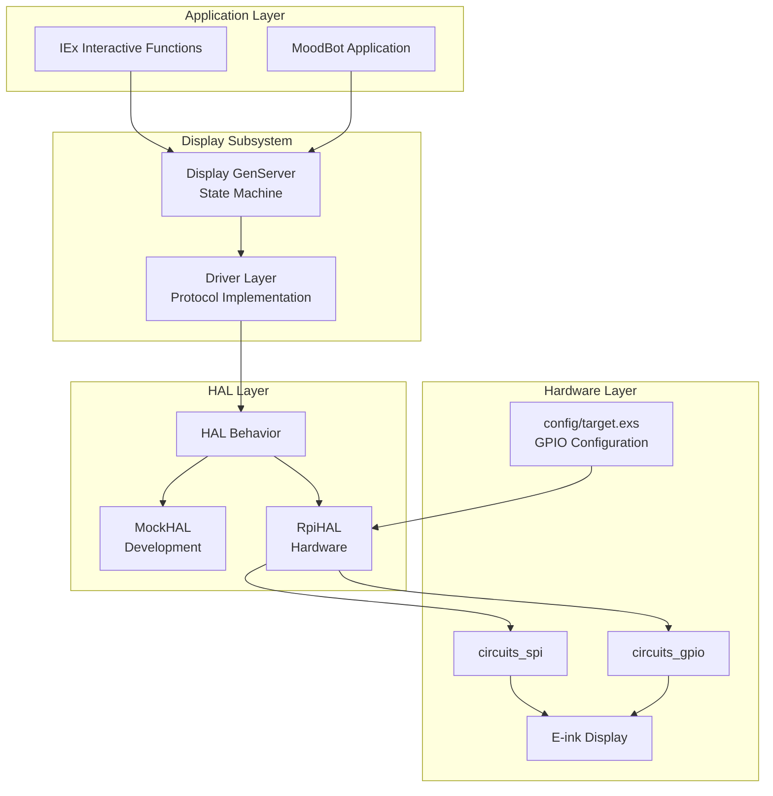

# Design Document
# Feature: working-display

## Overview

This design ensures the E-Ink display interaction cycle works reliably by leveraging the existing HAL architecture while ensuring compliance with the Python reference driver. The design builds on the proven patterns already implemented while addressing reliability issues and adding proper documentation and type specifications.

## Code Reuse Analysis

**Existing Components to Leverage:**
- **Display GenServer** (`lib/mood_bot/display.ex`): Complete state machine with timing management - reuse with enhancements
- **Driver Layer** (`lib/mood_bot/display/driver.ex`): Command sequences already match Python driver - reuse with documentation updates
- **HAL Interface** (`lib/mood_bot/display/hal.ex`): Solid behavior definition - reuse with expanded type specs
- **MockHAL** (`lib/mood_bot/display/mock_hal.ex`): Bitmap generation and logging - reuse as-is
- **RpiHAL** (`lib/mood_bot/display/rpi_hal.ex`): Hardware implementation - enhance with better error handling
- **Configuration Pattern** (`config/target.exs`): GPIO pin configuration using controller/offset tuples - reuse

**Integration Points:**
- GPIO configuration from `config/target.exs` (lines 100-110)
- IExHelpers for interactive debugging
- SSH MCP for remote function calls
- OTP supervision tree integration

## Architecture

### System Overview



### Component Specifications

#### 1. Enhanced Display GenServer

**Purpose**: Maintain existing state machine functionality while adding proper documentation and type specifications

**Enhancements Needed**:
- Add comprehensive `@doc` and `@spec` annotations
- Ensure GPIO configuration comes from application config
- Add IEx helper functions for interactive control
- Improve error reporting for SSH debugging

**Existing Functionality to Preserve**:
- State machine transitions (idle_and_ready, updating_display, etc.)
- Automatic refresh timing (3-minute cycles)
- Power management (5-minute sleep timeout)
- Partial update limits (5 updates before full refresh)

#### 2. Enhanced Driver Layer

**Purpose**: Maintain Python driver compliance while adding proper documentation

**Enhancements Needed**:
- Add detailed `@doc` annotations explaining each command
- Add `@spec` type specifications for all functions
- Cross-reference Python driver URLs in documentation
- Ensure timing constants match DRIVER.md specifications

**Existing Functionality to Preserve**:
- Complete command set matching Python driver
- LUT loading (WS_20_30 waveform)
- Initialization sequence
- Sleep/shutdown sequence

#### 3. Enhanced HAL Implementations

**Purpose**: Improve error handling and documentation while maintaining interface compatibility

**RpiHAL Enhancements**:
- GPIO configuration from `config/target.exs` using controller/offset tuples
- Better error reporting with context
- Hexdocs-verified circuits_gpio and circuits_spi usage
- Proper resource cleanup

**MockHAL Enhancements**:
- Enhanced bitmap saving with better filenames
- Improved logging for debugging
- Better simulation of hardware timing

#### 4. Interactive IEx Interface

**Purpose**: Provide easy access to display functions during SSH sessions

**New Functions in IExHelpers**:
```elixir
# Display control
def display_on()
def display_off()  
def display_status()

# Test patterns
def display_test_pattern(pattern_type)
def display_clear()
def display_fill_black()

# Diagnostics
def display_gpio_status()
def display_spi_test()
def display_reset_errors()
```

### Data Models

#### Configuration Structure
```elixir
@type config :: %{
  spi_device: String.t(),
  dc_gpio: Circuits.GPIO.gpio_spec(), 
  rst_gpio: Circuits.GPIO.gpio_spec(),
  busy_gpio: Circuits.GPIO.gpio_spec(),
  pwr_gpio: Circuits.GPIO.gpio_spec()
}
```

#### State Machine States
```elixir
@type refresh_state :: 
  :idle_and_ready | 
  :updating_display | 
  :refreshing_screen | 
  :power_saving
```

#### Error Reporting
```elixir
@type display_error :: 
  {:error, :not_initialized} |
  {:error, :invalid_state} |
  {:error, :timeout} |
  {:error, :gpio_error, term()} |
  {:error, :spi_error, term()}
```

### Error Handling Strategy

#### 1. Configuration Validation
- Validate GPIO pin specifications at startup
- Ensure SPI device exists and is accessible
- Provide clear error messages for misconfiguration

#### 2. Hardware Error Recovery
- Implement retry logic for transient SPI failures
- Graceful degradation when GPIO operations fail
- Automatic state recovery after hardware errors

#### 3. Remote Debugging Support
- Detailed error context in log messages
- GPIO pin status inspection functions
- SPI communication test utilities

### Testing Strategy

#### 1. Development Testing (MockHAL)
```elixir
# Existing capabilities to enhance
- Bitmap generation and saving
- Hardware operation simulation
- Timing simulation
- Error condition simulation
```

#### 2. Hardware Integration Testing
```elixir
# SSH-accessible test functions
def run_initialization_test()
def run_display_cycle_test()
def run_power_management_test()
def run_gpio_connectivity_test()
def run_spi_communication_test()
```

#### 3. Interactive Testing via IEx
```elixir
# Available during SSH sessions
iex> MoodBot.IExHelpers.display_test_pattern(:checkerboard)
iex> MoodBot.IExHelpers.display_gpio_status()
iex> MoodBot.IExHelpers.display_spi_test()
```

### Implementation Approach

#### Phase 1: Documentation and Type Specifications
- Add comprehensive `@doc` and `@spec` to all existing functions
- Cross-reference Python driver in documentation
- Verify all circuits_gpio and circuits_spi usage against hexdocs

#### Phase 2: Configuration Enhancement
- Ensure GPIO configuration comes from `config/target.exs`
- Add configuration validation at startup
- Improve error messages for configuration issues

#### Phase 3: Interactive Interface
- Extend IExHelpers with display control functions
- Add SSH-accessible diagnostic functions
- Implement test pattern generation

#### Phase 4: Error Handling Improvements
- Enhanced error reporting with context
- Better recovery from hardware failures
- Improved logging for remote debugging

### Compliance with Standards

#### Python Driver Compliance
- Command sequences match DRIVER.md specifications
- Timing constants follow reference implementation
- GPIO pin usage per Waveshare documentation
- Sleep/wake cycles follow Python patterns

#### Elixir/Nerves Best Practices
- Configuration externalized to `config/target.exs`
- Proper OTP supervision tree integration
- circuits_gpio usage following hexdocs patterns
- circuits_spi implementation per documentation

#### Educational Value
- Comprehensive documentation explaining hardware concepts
- Clear examples of HAL pattern implementation
- Interactive debugging capabilities
- Cross-references to hardware documentation

### Alignment with Steering Documents

#### Product Vision Alignment
- **Educational Value**: Comprehensive documentation and interactive debugging
- **Real-World Interaction**: Reliable display updates with visual feedback
- **Accessibility**: MockHAL enables development without hardware
- **Extensibility**: Clean HAL pattern for additional hardware

#### Technical Standards Compliance
- **Elixir/OTP**: Proper GenServer patterns and supervision
- **Nerves**: Standard configuration and deployment patterns
- **Hardware**: circuits_gpio and circuits_spi best practices
- **Testing**: Comprehensive test coverage with MockHAL

#### Project Structure Adherence
- **File Organization**: Follows established display subsystem structure
- **Naming Conventions**: Consistent with project patterns
- **Documentation**: Proper module and function documentation
- **Configuration**: Environment-specific configuration separation