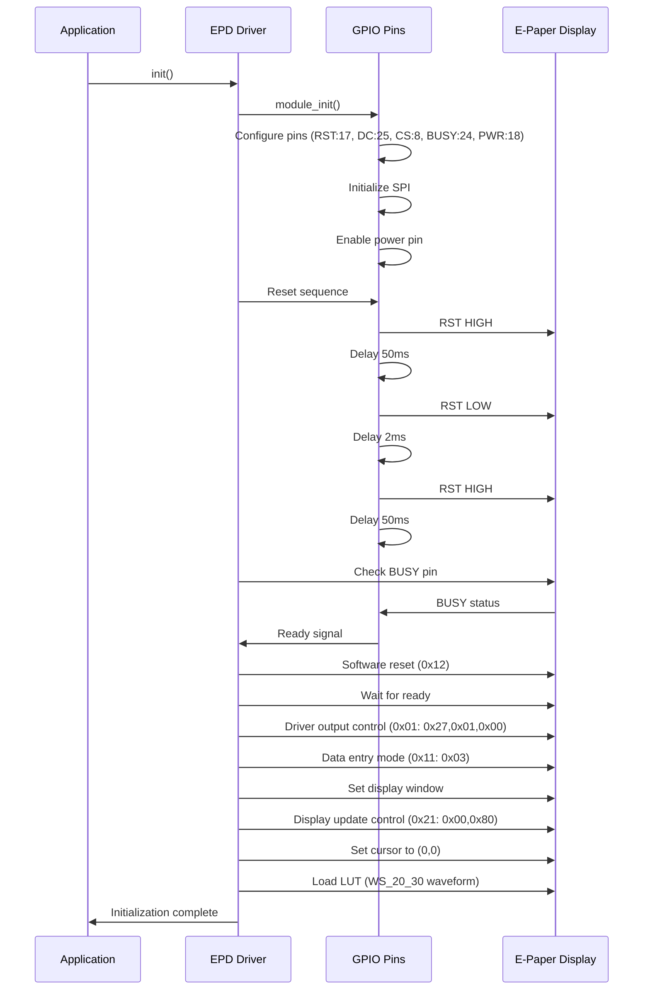
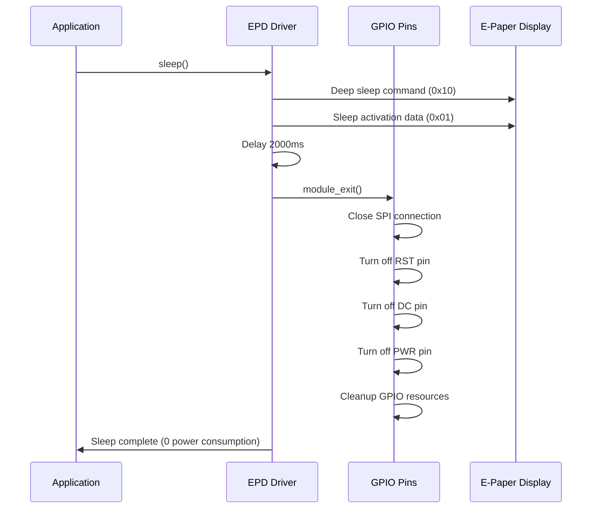

# Hardware Driver Documentation

## Waveshare E-Paper 2.9" V2 Display Driver

### Initialization Sequence

Based on the official Waveshare driver implementation, the e-paper display requires the following precise initialization sequence:

#### Initialization Steps

1. **Module Initialization**
   - Configure GPIO pins (RST:17, DC:25, CS:8, BUSY:24, PWR:18)
   - Initialize SPI communication
   - Enable power pin

2. **Hardware Reset Sequence**
   - Set reset pin HIGH
   - Delay 50ms
   - Set reset pin LOW  
   - Delay 2ms
   - Set reset pin HIGH
   - Delay 50ms

3. **Wait for Ready State**
   - Poll BUSY pin until device is ready

4. **Software Reset**
   - Send command 0x12 (software reset)
   - Wait for ready state

5. **Configure Driver Output Control**
   - Send command 0x01
   - Data: 0x27, 0x01, 0x00

6. **Set Data Entry Mode**
   - Send command 0x11
   - Data: 0x03 (X increment, Y increment)

7. **Set Display Window**
   - Configure display boundaries and active area

8. **Configure Display Update Control**
   - Send command 0x21
   - Data: 0x00, 0x80

9. **Set Cursor Position**
   - Initialize cursor to (0,0)

10. **Load Lookup Table (LUT)**
    - Load WS_20_30 waveform for display refresh timing

#### Initialization Flow Diagram

#### Pin Configuration

| Pin | GPIO | Function |
|-----|------|----------|
| RST | 17 | Reset |
| DC | 25 | Data/Command |
| CS | 8 | Chip Select |
| BUSY | 24 | Busy Status |
| PWR | 18 | Power |

#### Key Implementation Notes

- The hardware reset sequence timing is critical (50ms-2ms-50ms)
- BUSY pin polling is essential between operations
- LUT (Lookup Table) loading determines refresh characteristics
- Data entry mode 0x03 configures X/Y increment direction
- Driver output control sets display resolution and scanning direction

### Sleep/Shutdown Sequence

Based on the official Waveshare driver implementation, the e-paper display requires the following sequence to enter deep sleep mode and achieve zero power consumption:

#### Sleep Steps

1. **Send Deep Sleep Command**
   - Send command 0x10 (DEEP_SLEEP_MODE)
   - Send data 0x01 (sleep activation)

2. **Wait for Sleep Entry**
   - Delay 2000ms (2 seconds) to allow display to enter sleep mode

3. **Module Exit/Power Down**
   - Close SPI connection
   - Turn off GPIO pins (RST, DC, PWR)
   - Cleanup GPIO resources
   - Enter 0 power consumption state

#### Sleep Flow Diagram

#### Key Sleep Implementation Notes

- **Deep sleep command (0x10)** puts the display controller into minimal power mode
- **2-second delay** is critical to allow proper sleep entry
- **Power pin shutdown** ensures true 0 power consumption
- **GPIO cleanup** prevents resource leaks
- **SPI closure** releases communication resources
- The sleep sequence is much simpler than initialization - it essentially reverses the power-up process

#### References

- [Waveshare EPD 2.9" V2 Driver](https://raw.githubusercontent.com/waveshareteam/e-Paper/refs/heads/master/RaspberryPi_JetsonNano/python/lib/waveshare_epd/epd2in9_V2.py)
- [EPD Config Module](https://raw.githubusercontent.com/waveshareteam/e-Paper/refs/heads/master/RaspberryPi_JetsonNano/python/lib/waveshare_epd/epdconfig.py)
