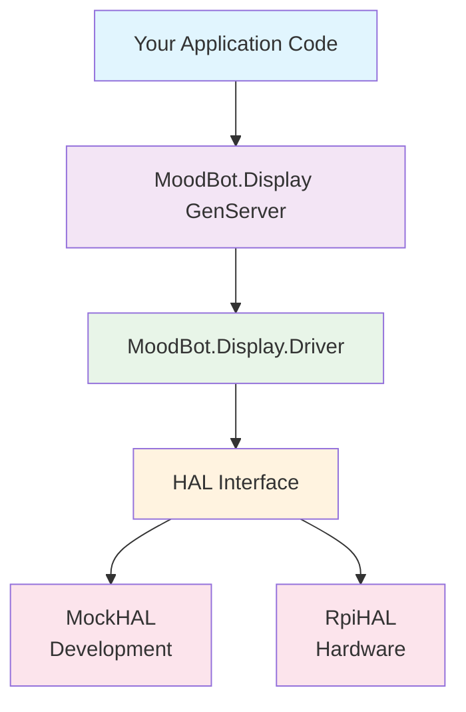
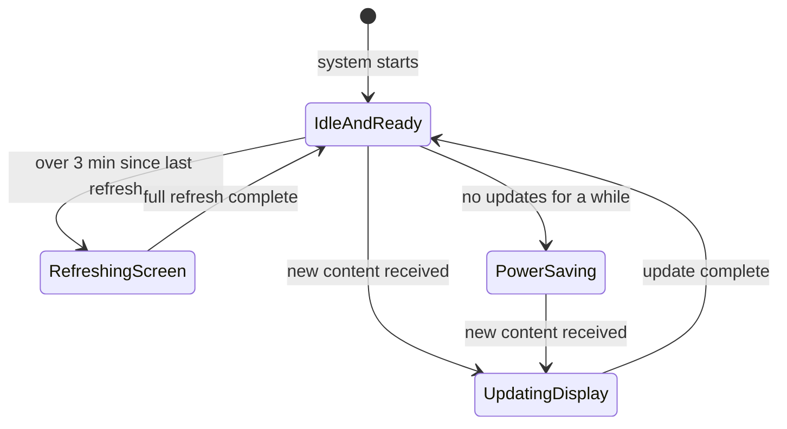

# MoodBot 🤖

Ever had your kid ask for a robot — and thought, "Hey… maybe we could build one together"?

MoodBot is the result of that idea: a little robot built with Elixir, Nerves, a Raspberry Pi, and some help from AI. It talks using text-to-speech, shows its mood on an e-ink display, and grows over time — from basic GenServers to more playful, AI-powered behavior.

It's designed for software engineers who want to learn embedded systems without getting lost in C and hardware registers. You get to explore e-ink displays, SPI communication, and GPIO control while building something your kids can actually interact with.

The best part? You can start coding immediately without any hardware — the mock HAL lets you develop and test everything on your laptop.

## What You'll Learn

This project will teach you practical embedded systems concepts:

- **SPI Communication**: How microcontrollers talk to peripheral devices
- **GPIO Control**: Managing hardware pins for reset, data/command selection
- **Hardware Abstraction**: Writing code that works on both development machines and embedded hardware
- **E-ink Display Technology**: Understanding refresh cycles, partial updates, and power management
- **OTP/GenServer Patterns**: Applying Elixir's actor model to hardware control
- **Embedded Development Workflow**: From laptop development to hardware deployment

No prior embedded experience required — we'll explain concepts as we go.

## Quick Start (Development Mode)

**Get started immediately without any hardware!** MoodBot includes a mock HAL that simulates the e-ink display for development.

### Prerequisites

- Elixir 1.18+ and Erlang/OTP 25+
- Mix build tool

### 1. Clone and Setup

```bash
git clone <repository-url>
cd mood_bot
mix deps.get
```

### 2. Run in Development Mode

```bash
# Start the application with mock hardware
mix run --no-halt

# Or start an interactive shell
iex -S mix
```

The application automatically uses the MockHAL when running on `:host` (your development machine), which logs all display operations to the console instead of sending them to actual hardware.

### 3. Try the Display API

In the IEx shell, you can interact with the mock display:

```elixir
# Initialize the display
MoodBot.Display.init_display()

# Clear the display (logs to console)
MoodBot.Display.clear()

# Show different moods
MoodBot.Display.show_mood(:happy)
MoodBot.Display.show_mood(:sad)
MoodBot.Display.show_mood(:neutral)
MoodBot.Display.show_mood(:angry)
MoodBot.Display.show_mood(:surprised)

# Check display status
MoodBot.Display.status()

# Display raw image data (generates test pattern)
alias MoodBot.DisplayTestHelper
test_image = DisplayTestHelper.test_image_data()
MoodBot.Display.display_image(test_image)

# Put display to sleep
MoodBot.Display.sleep()
```

## Development Workflow

### Running Tests

```bash
# Run all tests
mix test

# Run tests with coverage
mix test --cover

# Run specific test files
mix test test/mood_bot/display_test.exs
```

### Code Quality

```bash
# Format code
mix format

# Check code quality
mix credo --strict

# Run static analysis
mix dialyzer
```

## Architecture Overview

**Learning objective**: After this section, you'll understand how MoodBot's layered architecture lets you develop on your laptop and deploy to hardware without changing your code.

MoodBot uses a layered approach that lets you work with the same code whether you're developing on your laptop or running on a Raspberry Pi. This pattern is common in embedded development — it's called a Hardware Abstraction Layer (HAL).



The layers work like this:

- **MoodBot.Display**: The main GenServer that handles mood changes and display updates
- **MoodBot.Display.Driver**: Knows how to talk to the e-ink display (timing, refresh cycles)
- **HAL Interface**: Switches between mock and real hardware without changing your code
- **MockHAL**: Simulates everything for development — logs SPI writes, saves bitmap images
- **RpiHAL**: Actually toggles GPIO pins and talks to the real display

When you call `MoodBot.Display.show_mood(:happy)`, it works the same way in both modes. The only difference is whether it ends up as a log message or an actual display update.

This architecture is what lets you develop and test your robot's behavior entirely on your laptop, then deploy the exact same code to a Raspberry Pi.

## How the E-Paper Display Works

**Learning objective**: After this section, you'll understand why e-paper displays are perfect for embedded projects and how they communicate with microcontrollers.

The e-paper display is what makes MoodBot interesting. It's not just a screen — it behaves very differently from the displays you're used to.

### E-Ink Technology

E-paper displays have some unique characteristics:

- **Retains images without power** — like a printed page that you can change
- **Updates are slow but deliberate** — perfect for mood displays, not videos
- **Three colors available** — black, white, and red (on our Waveshare 2.9" display)
- **Partial updates** — you can change just a portion of the screen

### SPI Communication

The display uses SPI (Serial Peripheral Interface) to communicate with the Pi. Think of it as a one-way conversation from the Pi to the display:

```plaintext
Raspberry Pi                    E-Paper Display
     │                               │
     ├─ MOSI ──────────────────────→ │  (Data goes this way)
     ├─ CLK  ──────────────────────→ │  (Clock/timing)
     ├─ CS   ──────────────────────→ │  (Chip Select: "Hey, I'm talking to you!")
     ├─ DC   ──────────────────────→ │  (Data vs Command mode)
     ├─ RST  ──────────────────────→ │  (Reset the display)
     └─ BUSY ←────────────────────── │  (Display says "I'm busy updating")
```

Key pins explained:

- **CS (Chip Select)**: When low, the display listens. When high, it ignores you
- **DC (Data/Command)**: High = "here's image data", Low = "here's a command"
- **BUSY**: The display's way of saying "give me a moment to update"

### Display Update Process

Here's what happens every time MoodBot shows a new mood:



The two types of updates:

1. **Partial Updates** (fast, ~2 seconds)
   - Only updates changed pixels
   - Perfect for mood changes
   - Can cause "ghosting" over time

2. **Full Refresh** (slower, ~15 seconds)
   - Resets the entire display
   - Eliminates ghosting
   - Required every ~3 minutes

### Power Management

The e-paper display is much more power-efficient than regular screens:

- **During updates**: Uses power to rearrange the e-ink particles
- **When idle**: Uses zero power but retains the image
- **After 5 minutes**: Goes to sleep mode to save even more power

This is why MoodBot can run for days on a small battery.

Now that you understand the architecture and e-paper display fundamentals, let's see how to put it all together.

## Development with MockHAL

**Learning objective**: After this section, you'll understand how to develop and debug embedded code without any hardware, and how to visualize what your code would display on the actual e-ink screen.

The MockHAL is what makes MoodBot development so smooth. It simulates all hardware operations and gives you visual feedback about what your code is doing.

### What MockHAL Simulates

The MockHAL (`MoodBot.Display.MockHAL`) simulates all hardware operations:

- **SPI writes**: Logged with data size and first 8 bytes
- **GPIO operations**: Logs pin state changes with descriptions
- **Busy pin**: Randomly simulates busy/ready states
- **Sleep**: Actually sleeps to simulate timing
- **Bitmap saving**: Automatically saves display frames as viewable images

Example mock output:

```plaintext
[info] MockHAL: Initializing MockHAL for development mode with bitmap saving enabled (session: a1b2c3d4)
[info] MockHAL: SPI write 5 bytes: <<1, 2, 3, 4, 5>>
[info] MockHAL: Set DC pin to 1 (data mode)
[info] MockHAL: Saved bitmap frame 0 (session: a1b2c3d4)
[info] MockHAL: Read BUSY pin: 0 (ready)
```

### Visual Display Output

When running in development mode, MoodBot automatically saves visual representations of what would be displayed on the e-ink screen. These bitmap files are saved to `priv/bitmaps/` with filenames like:

```plaintext
session_a1b2c3d4_frame_000_1677123456789.pbm
session_a1b2c3d4_frame_001_1677123457890.pbm
```

Each file is a standard PBM (Portable Bitmap) image that can be opened in any image viewer to see exactly what was sent to the display. This makes it easy to:

- Debug display output visually
- Track the sequence of frames sent to the display
- Verify mood indicators and custom images look correct
- See the development history of display changes

The session ID changes each time you restart the application, and the frame counter increments for each image sent to the display.

## API Reference

### Display Control

```elixir
# Initialize hardware
{:ok | :error, reason} = MoodBot.Display.init_display()

# Clear display to white
:ok = MoodBot.Display.clear()

# Display moods (:happy, :sad, :neutral, :angry, :surprised)
:ok = MoodBot.Display.show_mood(:happy)

# Display raw image data (binary, 1 bit per pixel)
:ok = MoodBot.Display.display_image(image_binary)

# Sleep mode
:ok = MoodBot.Display.sleep()

# Get status
%{initialized: boolean(), display_state: atom(), ...} = MoodBot.Display.status()
```
### Image Format

The display expects binary data where:

- 1 bit per pixel (0 = black, 1 = white)
- Size: `(width / 8) * height` bytes
- Default dimensions: 296x128 pixels = 4736 bytes

## Hardware Setup (For Actual Deployment)

**Learning objective**: After this section, you'll know how to connect the hardware and deploy your code to a real Raspberry Pi.

### Supported Hardware

- Raspberry Pi (Zero, 3, 3A+, 4, 5)
- Waveshare 2.9" e-ink display
- MicroSD card (8GB+)

### Pin Connections

| Display Pin | RPi GPIO | Purpose |
|-------------|----------|---------|
| VCC         | 3.3V     | Power   |
| GND         | GND      | Ground  |
| DIN         | SPI MOSI | Data    |
| CLK         | SPI SCLK | Clock   |
| CS          | GPIO 8   | Chip Select |
| DC          | GPIO 25  | Data/Command |
| RST         | GPIO 17  | Reset   |
| BUSY        | GPIO 24  | Busy Signal |

### Building for Hardware

```bash
# Set target (rpi4, rpi5, etc.)
export MIX_TARGET=rpi4

# Build firmware
mix firmware

# Burn to SD card (replace /dev/sdX with your card)
mix burn

# Upload to running device over network (OTA update)
mix upload
```

## Over-The-Air (OTA) Updates

**Learning objective**: After this section, you'll understand how to update your deployed MoodBot remotely without physical access to the SD card.

Once you've deployed MoodBot to hardware, you can update it remotely using Nerves' built-in OTA capabilities. This is especially useful when your robot is deployed or hard to reach physically.

### Prerequisites for OTA Updates

1. **Network connectivity**: Your MoodBot must be connected to WiFi or Ethernet
2. **SSH access**: The device runs an SSH server for secure updates
3. **Initial deployment**: You need to burn the initial firmware to SD card first

### How OTA Updates Work

MoodBot uses SSH-based OTA updates through the `nerves_ssh` library:

1. Your development machine connects to MoodBot over the network
2. New firmware is transferred securely via SSH
3. Nerves applies the update using A/B partition swapping
4. The device reboots into the new firmware
5. If something goes wrong, it can automatically rollback

### Network Discovery

MoodBot advertises itself on the local network as `nerves.local` via mDNS. You can also connect directly via IP address.

```bash
# Connect to the device
ssh nerves.local

# Or find the IP and connect directly
ssh 192.168.1.100
```

### Updating via mix upload

The simplest way to update your deployed MoodBot:

```bash
# Set your target environment
export MIX_TARGET=rpi4

# Build new firmware
mix firmware

# Upload to the running device
mix upload

# Specify device if multiple devices are present
mix upload --target nerves.local
mix upload --target 192.168.1.100
```

The upload process:
1. Transfers the new firmware file to the device
2. Applies the update to the inactive partition
3. Switches to the new partition on next reboot
4. Automatically reboots the device

### Manual OTA Updates

For more control, you can manually apply updates:

```bash
# Connect to the device
ssh nerves.local

# Check current firmware info
iex> Nerves.Runtime.KV.get_all()

# Upload firmware file separately (via scp, sftp, etc.)
scp mood_bot.fw nerves.local:/data/

# Apply the update manually
iex> cmd("fwup -i /data/mood_bot.fw --apply --task upgrade " <>
         "--no-unmount -d #{Nerves.Runtime.KV.get("nerves_fw_devpath")}")

# Reboot to new firmware
iex> reboot()
```

### SSH Authentication

MoodBot automatically discovers SSH public keys from your `~/.ssh` directory. If no keys are found, you'll need to add them:

```bash
# During development - keys are discovered automatically
ls ~/.ssh/id_*.pub

# Add keys at runtime if needed
iex> NervesSSH.add_authorized_key("ssh-rsa AAAAB3N...")

# Or set via environment before building
export NERVES_SSH_AUTHORIZED_KEYS="ssh-rsa AAAAB3N...your-key-here"
mix firmware
```

### Firmware Patches (Advanced)

For bandwidth-limited deployments, Nerves supports delta updates that only transfer changes:

```bash
# Generate a patch from old to new firmware  
mix firmware.patch --source old_firmware.fw --target new_firmware.fw

# Upload the much smaller patch file
mix upload --firmware patch.fw
```

This can reduce update sizes from ~20MB to ~4MB depending on changes.

### Troubleshooting OTA Updates

**Can't connect to device:**
- Verify device is on network: `ping nerves.local`
- Check SSH service: `ssh nerves.local` should prompt for authentication
- Verify your SSH key is authorized

**Upload fails:**
- Ensure enough free space: `df -h` on device  
- Check network stability during large transfers
- Try manual upload via `scp` first

**Device won't boot after update:**
- Nerves automatically rolls back failed updates
- Connect via serial console if available
- Check logs: `dmesg` or `journalctl`

**Multiple devices on network:**
- Use specific IP instead of `nerves.local`
- Each device has unique hostname: `nerves-<serial>.local`

## Configuration

### Application Config

```elixir
# config/target.exs (hardware-specific)
config :mood_bot, MoodBot.Display,
  spi_device: "spidev0.0",
  dc_pin: 25,
  rst_pin: 17,
  busy_pin: 24,
  cs_pin: 8

# config/host.exs (development)
# Uses MockHAL automatically, no config needed
```

### Runtime Configuration

Override config when starting the display:

```elixir
custom_config = %{dc_pin: 26, rst_pin: 18}
{:ok, pid} = MoodBot.Display.start_link(config: custom_config, name: :my_display)
```

## Troubleshooting

### Common Issues

**Display not initializing:**

- Check pin connections and power supply
- Verify SPI is enabled: `sudo raspi-config` → Interface Options → SPI

**Build failures:**

- Ensure correct MIX_TARGET is set
- Clean build: `mix deps.clean --all && mix deps.get`

**Mock HAL not working:**

- Ensure running on `:host` target (not hardware target)
- Check logs for MockHAL initialization messages

### Debug Mode

Enable detailed logging:

```elixir
# In IEx
Logger.configure(level: :debug)

# Or in config
config :logger, level: :debug
```

## Contributing

1. Fork the repository
2. Create your feature branch
3. Make changes and add tests
4. Run code quality checks: `mix format && mix credo --strict && mix dialyzer`
5. Submit a pull request

## License

MIT License

## Learn More

- [Nerves Project](https://nerves-project.org/) - Embedded Elixir framework
- [Circuits](https://github.com/elixir-circuits) - Hardware interface libraries
- [E-ink Display Datasheet](https://www.waveshare.com/wiki/2.9inch_e-Paper_Module) - Hardware specifications
- [Circuits.SPI](https://github.com/elixir-circuits/circuits_spi) - SPI communication library
- [Circuits.GPIO](https://github.com/elixir-circuits/circuits_gpio) - GPIO control library
