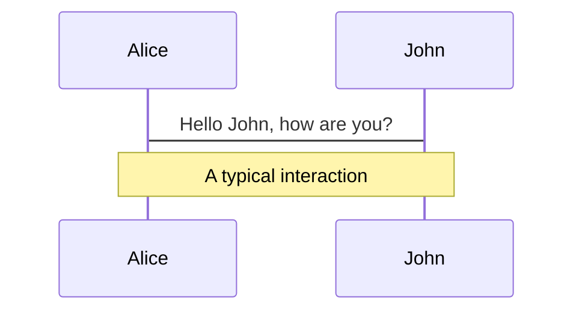
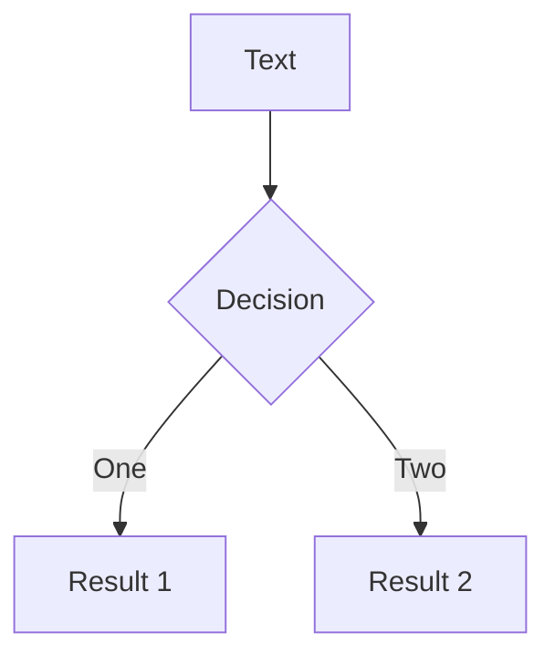
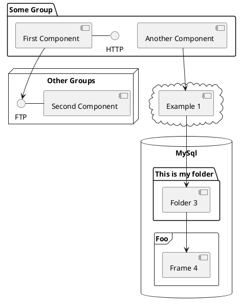

---
layout: image-right
showLogo: false
showFooter: false
hideInToc: true
image: /node_modules/@tngtech/slidev-theme-tng/assets/img/tree.png
title: "Table of contents"
---

<Toc maxDepth="1" />

---
title: "Welcome to the TNG Slidev theme"
subheading: "Goals"
---

* Provide an easy to use, yet flexible presentation template.
* Provide a recognizable TNG corporate identity look.
* And a decent set of slide layouts for different use-cases.
* Good out-of-the-box defaults.

---
layout: section
sectionNumber: 2
---

# Getting started

---
title: "Getting started"
hideInToc: true
---

Connect to the TNG VPN and run the following commands:

```shell
npm config set @tngtech:registry=https://nexus-k8s.int.tngtech.com/repository/npm-group/
npm init @tngtech/slidev-presentation@latest presentation-name
```

Start the presentation with:

```shell
cd presentation-name
npm run dev
```

Export the presentation as PDF:

```shell
npm run export
```

---
title: "Documentation"
---

* [Read the theme documentation.](https://docs.slides.tngtech.com)
* <Link to="/slidev-welcome">Learn more about Slidev.</Link>
* CLI help:
    ```shell
    npx slidev --help
    ```

---
layout: section
sectionNumber: 3
---

# A few slide layout examples

---
layout: two-cols
title: "two-cols layout"
subheading: "Lorem ipsum"
right:
  class: bg-tng
level: 2
---

Lorem ipsum dolor sit amet, consectetur adipiscing elit. Integer turpis ante, viverra at erat a, bibendum rhoncus neque.
Etiam sit amet est sed lectus mattis fringilla a id enim. Nulla placerat aliquam faucibus. Duis dui sapien, congue vitae
viverra at, tincidunt ut purus. In hac habitasse platea dictumst.

::right::

<AutoFitImg src="/node_modules/@tngtech/slidev-theme-tng/assets/img/background/supercollider.png" alt="Supercollider" />

---
layout: three-cols
title: "three-cols layout"
subheading: "Lorem ipsum"
middle:
  class: p-16
right:
  image: /img/software-consultant.png
level: 2
---

Lorem ipsum dolor sit amet, consectetur adipiscing elit. Integer turpis ante, viverra at erat a, bibendum rhoncus neque.
Etiam sit amet est sed lectus mattis fringilla a id enim. Nulla placerat aliquam faucibus. Duis dui sapien, congue vitae
viverra at, tincidunt ut purus. In hac habitasse platea dictumst.

::middle::

<VCenter>

* <Bubble><tng-lightbulb /></Bubble> Testen
* <Bubble><tng-circle-minus-solid /></Bubble> Nicht
* <Bubble><tng-rocket /></Bubble> Glauben

</VCenter>

---
layout: fact
title: "fact layout"
level: 2
---

Present a short fact or number.


---
layout: statement
title: "statement layout"
level: 2
---

The `statement` layout gives prominence to some statement.

---
layout: quote
title: "quote layout"
level: 2
---

The `quote` layout can be used to display a quote one a slide.

::quotee::

The theme developer

---
layout: ending
hideInToc: true
title: "Thank you for your attention"
subheading: "Any questions?"
level: 2
---

---
layout: speaker
---

---
layout: section
sectionNumber: 4
routeAlias: slidev-welcome
---

# Welcome to Slidev

<!--
The last comment block of each slide will be treated as slide notes. It will be visible and editable in Presenter Mode along with the slide. [Read more in the docs](https://sli.dev/guide/syntax.html#notes)
-->

---
transition: fade-out
title: "What is Slidev?"
level: 2
---

Slidev is a slides maker and presenter designed for developers, consist of the following features

- 📝 **Text-based** - focus on the content with Markdown, and then style them later
- 🎨 **Themable** - theme can be shared and used with npm packages
- 🧑‍💻 **Developer Friendly** - code highlighting, live coding with autocompletion
- 🤹 **Interactive** - embedding Vue components to enhance your expressions
- 🎥 **Recording** - built-in recording and camera view
- 📤 **Portable** - export into PDF, PNGs, or even a hostable SPA
- 🛠 **Hackable** - anything possible on a webpage

Read more about [Why Slidev?](https://sli.dev/guide/why)

<!--
You can have `style` tag in markdown to override the style for the current page.
Learn more: https://sli.dev/guide/syntax#embedded-styles
-->

<style>
h1 {
  background-color: #2B90B6;
  background-image: linear-gradient(45deg, #4EC5D4 10%, #146b8c 20%);
  background-size: 100%;
  -webkit-background-clip: text;
  -moz-background-clip: text;
  -webkit-text-fill-color: transparent;
  -moz-text-fill-color: transparent;
}
</style>

<!--
Here is another comment.
-->

---
transition: slide-up
title: "Navigation"
level: 2
---

Hover on the bottom-left corner to see the navigation's controls panel, [learn more](https://sli.dev/guide/navigation.html)

### Keyboard Shortcuts

|     |     |
| --- | --- |
| <kbd>right</kbd> / <kbd>space</kbd>| next animation or slide |
| <kbd>left</kbd>  / <kbd>shift</kbd><kbd>space</kbd> | previous animation or slide |
| <kbd>up</kbd> | previous slide |
| <kbd>down</kbd> | next slide |

<!-- https://sli.dev/guide/animations.html#click-animations -->

<p v-after class="absolute bottom-23 left-45 opacity-30 transform -rotate-10">Here!</p>

---
layout: image-right
image: https://source.unsplash.com/collection/94734566/1920x1080
title: "Code"
level: 2
---

Use code snippets and get the highlighting directly![^1]

```ts {all|2|1-6|9|all}
interface User {
  id: number
  firstName: string
  lastName: string
  role: string
}

function updateUser(id: number, update: User) {
  const user = getUser(id)
  const newUser = { ...user, ...update }
  saveUser(id, newUser)
}
```

<arrow v-click="3" x1="400" y1="420" x2="230" y2="330" color="#564" width="3" arrowSize="1" />

[^1]: [Learn More](https://sli.dev/guide/syntax.html#line-highlighting)

<style>
.footnotes-sep {
  @apply mt-20 opacity-10;
}
.footnotes {
  @apply text-sm opacity-75;
}
.footnote-backref {
  display: none;
}
</style>

---
title: "Components"
level: 2
---

<div grid="~ cols-2 gap-4">
<div>

You can use Vue components directly inside your slides.

We have provided a few built-in components like `<Tweet/>` and `<Youtube/>` that you can use directly. And adding your custom components is also super easy.

Check out [the guides](https://sli.dev/builtin/components.html) for more.

</div>
<div>

```html
<Tweet id="1390115482657726468" />
```

<Tweet id="1390115482657726468" scale="0.65" />

</div>
</div>

<!--
Presenter note with **bold**, *italic*, and ~~striked~~ text.

Also, HTML elements are valid:
<div class="flex w-full">
  <span style="flex-grow: 1;">Left content</span>
  <span>Right content</span>
</div>
-->


---
preload: false
title: "Animations"
level: 2
---

Animations are powered by [@vueuse/motion](https://motion.vueuse.org/). [Learn More](https://sli.dev/guide/animations.html#motion)

```html
<div
  v-motion
  :initial="{ x: -80 }"
  :enter="{ x: 0 }">
  Slidev
</div>
```

<div class="w-60 relative mt-6">
  <div class="relative w-40 h-40">
    
    
    
  </div>

  <div
    class="text-5xl absolute top-14 left-40 text-[#2B90B6] -z-1"
    v-motion
    :initial="{ x: -80, opacity: 0}"
    :enter="{ x: 0, opacity: 1, transition: { delay: 2000, duration: 1000 } }">
    Slidev
  </div>
</div>

<!-- vue script setup scripts can be directly used in markdown, and will only affects current page -->
<script setup lang="ts">
const final = {
  x: 0,
  y: 0,
  rotate: 0,
  scale: 1,
  transition: {
    type: 'spring',
    damping: 10,
    stiffness: 20,
    mass: 2
  }
}
</script>

<div
  v-motion
  :initial="{ x:35, y: 40, opacity: 0}"
  :enter="{ y: 0, opacity: 1, transition: { delay: 3500 } }">


</div>

---
title: "LaTeX"
level: 2
---

LaTeX is supported out-of-box powered by [KaTeX](https://katex.org/).

<br>

Inline $\sqrt{3x-1}+(1+x)^2$

Block
$$
\begin{array}{c}

\nabla \times \vec{\mathbf{B}} -\, \frac1c\, \frac{\partial\vec{\mathbf{E}}}{\partial t} & = & \frac{4\pi}{c}\vec{\mathbf{j}} \\

\nabla \cdot \vec{\mathbf{E}} & = & 4 \pi \rho \\

\nabla \times \vec{\mathbf{E}}\, +\, \frac1c\, \frac{\partial\vec{\mathbf{B}}}{\partial t} & = & \vec{\mathbf{0}} \\

\nabla \cdot \vec{\mathbf{B}} & = & 0

\end{array}
$$

<br>

[Learn more](https://sli.dev/guide/syntax#latex)

---
title: "Diagrams"
level: 2
---

You can create diagrams / graphs from textual descriptions, directly in your Markdown.

<div class="grid grid-cols-3 gap-10 pt-4 -mb-6">







</div>

[Learn More](https://sli.dev/guide/syntax.html#diagrams)

---
src: ./pages/multiple-entries.md
hide: false
---

---
layout: section
title: "Learn More"
---

* <Bubble><tng-page /></Bubble> [Theme documentation](https://docs.slides.tngtech.com)
* <Bubble><tng-code /></Bubble> [Bitbucket repository](https://bitbucket.int.tngtech.com/projects/SPT/repos/slidev-tng/browse)
* <Bubble><tng-comments-round /></Bubble> [Slack channel #html-slides](https://tngtech.slack.com/archives/C010FRHRFH9)

::sectionNumber::

<tng-rocket />
