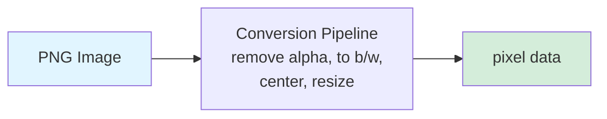
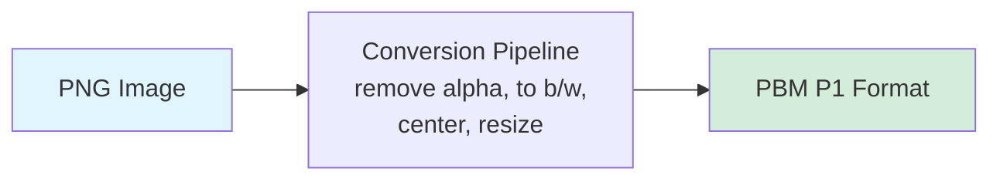

<!--
Yeah, hello everybody!
It's great having you all here today.
This is my talk. It's about rising a tiny robot with Elixir, Nerves, and AI.
And it is a story about hardware, struggle, relief, and experiences with tooling and Elixir ecosystem as a whole.
-->

---
title: "Hi, I am Carsten. 👋"
---

- Studied Computer Science, PhD in Mathematics
- 10+ years Software Consultant at TNG (consultancy originated in Munich)
- Father of two boys, 7 and 9 yo

<div class="mt-6 p-6 bg-gray-50 rounded-lg border-l-4 border-blue-500">
  <p class="italic text text-gray-700">
    Können wir selbst einen Roboter bauen?<br />
    Er soll sich bewegen können und mit mir reden!
  </p>
  <p class="text-sm text-gray-600 mt-3">— my older son 😊</p>
</div>

<!--
Hi, I'm Carsten. Back in the days, I studied computer science, and did my PhD in mathematics over 10 years ago.
And straight from the university I joined TNG, which is a software consultantcy with now over 900 employees, founded 25 years ago in Munich, with a couple of international offices by now.

More importantly for this talk, I am also the father of two boys, 7 and 9 years old.
And my older son, the nine-year-old a while ago asked me: can we build a robot ourselves? The robot should be able to move and also talk to me!

That didn’t just come out of nowhere.
-->

---
layout: section
---

# The Spark

::sectionNumber::

<tng-lightbulb />

<!--
Instead, this was a topic for us brewing up over a longer time by then.
So this is my story of how I responded.
-->

---
title: "The Spark (2020)"
---

<div class="flex items-center justify-center">
  
</div>

<!--
The whole interest of my older son in robots started a while ago.
He was always interested in technical stuff
And roughly 5 years ago, he got his first toy robot. 

This robot was cute, but not really capable.
It was able to follow you if you pressed a button on the remote and do some dances and noise that was pre-programmed.
That's it.

So the interest in this robot was lost quite quickly.
-->

---
title: "The Spark (2020)"
---

<div class="flex items-center justify-center">
  <SlidevVideo controls muted class="h-90">
    <source src="/img/Robotic Arm.mov" type="video/quicktime" />
  </SlidevVideo>
</div>

<!--
Fast forward two years, in 2022 we bought a DIY robotic arm kit with servo motors.
Well, mainly I built it but my older son was very helpful in tightening the screws. ;)
The arm was attached to a Raspberry Pi and programmed using Python.

It was fun to build and a program, but the interaction with the outside world was quite limited.
There was no speech, there was no vision.
And in order to extend its behavior, you had to program.

Not that ideal for six year-old.
-->

---
title: "The Spark (2024)"
---

<div class="flex items-center justify-center">
  
</div>

<!--
Last year, we were at the "Deutsches Museum" in Munich.

As part of their robotics exhibition, one of the employees went around of this robotic dog.
And of course it's bar a lot of interest in all the people standing around including my kids.

This kind of robot is obviously the oppostive of the toy robot and robotic arm we've seen.
And definitely nothing we could afford or even there to build ourselves.

But the question persisted: Can we build something smart ourselves?
-->

---
title: But Where To Get Started?
---

<div class="flex items-center justify-center">
  
</div>

<!--
So, early 2025 we finally discussed building something ourselves.

And as every good robotics project needs a cute avatar, my son started to draw something for me: a collection of robotic faces.
This gave birth to the idea of the MoodBot, a robotics project which interacts with you and tries to "understand" the mood your are in.

Now the only question was: where and how to get started?
-->

---
title: My Daily Tech
---

5 main clients over 10+ years, 4 different language ecosystems.

<div class="flex items-center justify-center gap-6 mt-8">
  <div class="flex flex-col items-center gap-2">
    
    <span class="text-sm text-gray-500">2015</span>
  </div>
  <span class="text-4xl text-gray-400">→</span>
  <div class="flex flex-col items-center gap-2">
    
    <span class="text-sm text-gray-500">2017</span>
  </div>
  <span class="text-4xl text-gray-400">→</span>
  <div class="flex flex-col items-center gap-2">
    
    <span class="text-sm text-gray-500">2020</span>
  </div>
  <span class="text-4xl text-gray-400">→</span>
  <div class="flex flex-col items-center gap-2">
    
    <span class="text-sm text-gray-500">2022</span>
  </div>
</div>

So... let's pick Elixir then! 😄

<!--
My professional background from five clients in 10 years was in four different language ecosystems: Ruby, Python, C, and TypeScript.

During my ruby project years, I learned about the existance of Elixir, and I liked it since then.
But... Aside from smaller side project and TNG internal workshops, I did no paided programming project using Elixir.

So for the robotics project, I could have just opted it for Python and be probably OK.
But I actually wanted to build something in Elixir for three main reasons:

1. I still like the language.
2. I like the foundation it is build on: processes, message passing, GenServers---you name it.
3. The ecosystem has grown quite a bit over time

And I wanted to explore how far I can come with the part-time knowledge I had.
-->

---
title: Vibe Away
layout: two-cols
---

<div class="flex items-center justify-center">
  
</div>

::right::

<div class="flex items-center justify-center">
  
</div>

<!--
- Earlier this year, I got the confidence push that I needed by the rise of vibe coding and the introduction of MCPs (Model Context Protocol) servers.
- was quite excited back then, and I just dove in
- "maybe I can build this!"
-->

---
title: Elixir Maturity
disabled: true
---

**What I knew:**
- Nerves: "Elixir for embedded systems"
- Bumblebee: "ML models in Elixir"

**What I hadn't done:**
- Production Elixir ✗
- Hardware projects ✗
- Combining them ✗

**The gap:** Knowledge → Experience

<!--
I'd read  about these tools, done workshops, side projects.
But never shipped anything real with Elixir.
Never touched hardware with Elixir.
This project was my leap from "I know of this" to "I built with this."
-->

---
title: The Fuzzy Plan
---

<div class="flex items-center justify-center">
  
</div>

<!--
TODO Update/simplify speaker notes

So at this point, early 2025, I had this very loose idea.
I knew I wanted to use the Raspberry Pi I had sitting in a drawer.
I thought: put a screen on it, let me talk to it or press buttons or something, and then show the robot's reply on that screen.

But honestly? I had no clue about the details.
What kind of screen? How would the interaction work? What would the robot actually do?
All of that was completely unclear.

But sometimes you just need to start, even when the plan is fuzzy.
The clarity comes from building, from hitting problems, from making decisions as you go.
-->

---
layout: section
# sectionNumber: 2
---

# Moods On Display

::sectionNumber::

<tng-screen-device />

<!--
Since having visuals early on give the most feeling of progress, we started there.
-->

---
title: Nerves
layout: two-cols
---

<div class="flex flex-col items-center gap-2">
  
</div>

Craft embedded firmware with Elixir

- Minimal Linux → boots to BEAM
- Framework: Pre-built libraries for embedded development
- Tooling: Build, burn, deploy firmware

**Workflow:**
```shell
mix firmware
mix upload
```

::right::

<div class="flex flex-col items-center gap-2">
  
  <!--  -->
</div>

<!--
The foundation for this project is Nerves.

Nerves is an Elixir framework specifically built for embedded systems.
It gives you a minimal Linux distribution that boots straight to the BEAM virtual machine.
You get pre-built libraries for common embedded tasks, and tooling to build and deploy firmware.

The workflow is straightforward: set your target, run mix firmware to build, mix upload to deploy.

This is a really pleasant workflow.
-->

---
title: Pick An E-Ink Display
layout: two-cols
---

::left::

<div class="flex items-center justify-center">
  
</div>

::right::

<div class="flex items-center justify-center">
  
</div>

<!--
TODO [H] Show picture of E-Ink display
TODO [M] Show dislay initialization structure (GPIO, reset, hal, ...)
-->

<!--
So after deciding to focus on displaying moods, I needed to pick a screen.
I went with a Waveshare 2.9 inch E-Ink display.

Why E-Ink? A couple of reasons.
First, it looks cool. That paper-like quality just fits the aesthetic I had in mind for a robot face.
Second, it's low power - once you draw something, it stays there without using energy.
And third, Waveshare had a Python library for it, which I thought would make porting to Elixir straightforward.

I looked at the Python code and thought: "Yeah, this looks manageable. Just send some commands over SPI, initialize the display, push some pixels. How hard can it be?"

Spoiler alert: it was not straightforward.
-->

---
title: Vibing The Display Driver
layout: two-cols
---

::left::

**Python (Waveshare)**

```python {all|2-3|all}
def init(self):
    if (epdconfig.module_init() != 0):
        return -1

    self.reset()
    self.reset()
    self.ReadBusy()
    self.send_command(0x12)
    self.ReadBusy()

    self.send_command(0x01)
    self.send_data(0x27)
    self.send_data(0x01)
    # ... 15 more commands

    self.SetLut(self.WS_20_30)
    return 0
```

No explicit state tracking.

::right::

<v-click>

**Elixir (my port)**

```elixir
defp init_display(state) do
  with {:ok, state} <- reset_hal(state),
       {:ok, state} <- wait_idle(state),
       {:ok, state} <- send_command(state, @cmd_reset),
       {:ok, state} <- wait_idle(state),
       # ... monadic chain
       {:ok, state} <- set_lut(state, @wf_full) do

    Logger.info("Driver initialization complete")
    {:ok, state}
  end
end
```

Added GenServer + monadic error handling.

</v-click>

<!--
TODO [M] For the code highlight: example of how state was spread in the code that we had to manage correctly.

So I started porting the Python driver to Elixir using Claude Code.

On the left, you can see the Python version from Waveshare.
It's very imperative: call this function, call that function, send some commands, send some data.
No real state management. Just a sequence of operations that hopefully work.

On the right is my Elixir port, mostly written by Claude Code.
I guided it toward monadic error handling with those with statements, made some small corrections along the way.
Every operation explicitly threads the state through, and if anything fails, it short-circuits early with a clear error.

And honestly? Even though Claude wrote most of it, watching it come together felt great!
The code looked clean, the error handling was explicit, everything seemed to make sense.
I deployed it to the Raspberry Pi and ran the initialization.

But the display? Just blank.

Alright. Time to debug.
-->

---
title: Great, ... Initially
---

<div class="flex flex-col items-center gap-2">
  
</div>

<!--
And this is where the development experience really shines.

This screenshot shows my actual workflow with Claude Code.
I'm using two Model Context Protocol servers here: SSH MCP and HexDocs MCP.

With SSH MCP, I can deploy firmware to the Raspberry Pi, run commands remotely, and debug directly on the device - all from within the Claude Code conversation.
No switching to a terminal. No copy-pasting commands.

With HexDocs MCP, I can look up Elixir library documentation instantly.
Claude has access to the full Hex documentation, so when I'm working with VintageNet or Circuits.GPIO or whatever, it can pull up the exact function signatures and examples right there.

So the loop becomes: write code, deploy, test, check docs, iterate.
All in one conversation. No context switching.

This is what made vibe coding actually work for me on this project.
Without this tight feedback loop, I'm not sure I would have gotten as far as I did.
-->

---
title: "Success. Grief. Relief."
layout: two-cols
---

::left::

Code compiled. Nothing rendered. 😭

```elixir {all|4-5}
with {:ok, state} <- reset_hal(state),
     # ... 15 initialization commands ...
     {:ok, state} <- send_data_hal(state, <<0x00>>),
     {:ok, state} <- send_data_hal(state, <<0x80>>),
     #                        wrong code 😔 ^^^^
     {:ok, state} <- set_memory_pointer(state, 0, 0),
     {:ok, state} <- set_lut(state, @wf_full) do
  # Initialized! 🥳
end
```

::right::

<div class="flex items-center justify-center">
  <div class="w-45">
    <SlidevVideo v-click controls muted>
      <source src="/img/e-ink first demo.mov" type="video/quicktime" />
    </SlidevVideo>
  </div>
</div>

<!--
So the debugging began.

This was during one of our internal TechDays at TNG - a full day to work on side projects.
I started early, put the Python code on the left screen, my Elixir code on the right, and started comparing.

Around 10am, I found it.
One single hex byte - that 0x80 you see highlighted - was in the wrong position in the initialization sequence.
Everything else was correct. Just that one byte, one command too early.

Here's the thing: the code compiled fine. It ran without errors.
Claude had ported most of the Python code correctly, but it also forgot things along the way - probably because I didn't give it enough focus or structure the context properly.

This is where I learned something important about working with AI on hardware.
You can't just accept the output and move on.
You need to verify each step, understand what each command does, check the timing requirements, validate the initialization sequence.

I had been too trusting.
The code looked reasonable, so I assumed it was correct.
That assumption cost me weeks of debugging.

The lesson: break things into smaller steps, verify each piece, and actually understand what you're building.
Not just for hardware - that applies everywhere.
-->

---
title: "Image Pipeline: Got Ambitious"
disabled: true
---

1. flash firmware (ssh mcp)
2. run display test routine (ssh mcp)
3. capture e-ink display (camera mcp)
4. normalize camera images (opencv mcp)
5. heatmap-based comparison w/ reference image (opencv mcp)

Would be huge for e2e test text and image rendering!

<!--
So with the E-Ink display finally working, I got ambitious.

I wanted to build a proper testing setup for the image pipeline.
The idea was: render an image on the E-Ink display, photograph it with a camera, use OpenCV to compare it against the expected output, and verify everything was working correctly.

I did some research, used the Spec-Driven Workflow with Claude Code to draft a plan, even started taking measurements to 3D-print a scanning bench for the camera setup.

This diagram shows the architecture I had in mind.
Multiple MCP servers orchestrating the whole thing: SSH to control the device, Camera to capture images, OpenCV to process and compare them.
Automated end-to-end testing for the display pipeline.

It was a comprehensive plan.
And looking back... completely overengineered for what I needed at that stage.
-->

---
title: "Image Pipeline: The Plan"
---

on device:



<v-click>

Chose `image` library, based on `vix`

</v-click>

<v-switch>
<template #1>
During build, downloads precompiled binaries for macOS, while the target of is actually RPi3:

```
{:error,
 {:load_failed,
  ~c"'(...)/_build/rpi3_dev/lib/vix/priv/vix.so' (slice is not valid mach-o file)'"}}
```
</template>

<template #2>
Lucky me (just in time by end of July):


```elixir
# (mix.exs)
{:image, "~> 0.62"},
# Nerves support - precompiled artifacts #130
{:vix, git: "https://github.com/akash-akya/vix.git", branch: "master", override: true},
```
</template>

<template #3>
I get yet another error:

```shell
❯ MIX_TARGET=rpi3 mix firmware
Error happened while installing vix from precompiled binary: "missing checksum.exs file".

Attempting to compile vix from source...
Setting up precompiled libvips...

armv7-nerves-linux-gnueabihf-gcc: error: unrecognized command-line option '-flat_namespace'
```
</template>
</v-switch>


<!--
TODO Make the slide easier to digest. Add more meat to it. Like: Is there something specific I tried that needs to be mentioned?

But before I could even build that testing setup, I needed to get image processing working on the device.

The plan was: take PNG images, run them through a conversion pipeline on the device - remove alpha channel, convert to black and white, center, resize to display dimensions - and then push the pixel data to the E-Ink.

I found a library called vix, which wraps libvips for image processing.
And actually, the timing was perfect - Nerves support had just been added to the master branch.

So I added it to my mix.exs, tried to build the firmware, and... compilation errors.
Lots of them.

The error messages showed it was trying to cross-compile native dependencies from macOS to ARM Linux, and the build scripts were injecting macOS-specific flags into the Linux compiler.

I tried forcing builds, setting environment variables, went down GitHub rabbit holes looking for solutions.
Nothing worked.

This was the first time I really hit the cross-compilation wall with the Elixir ecosystem.
-->


---
title: "Image Pipeline: The Build"
layout: two-cols
---

<!-- TODO [L] v-top the content -->
<!-- TODO [L] prettify the mermaid diagrams -- or use excalidraw -->

::left::

on my laptop:



```
P1
# A heart in 8x6 pixels
8 6
1 0 0 1 1 0 0 1
0 1 1 0 0 1 1 0
0 1 1 1 1 1 1 0
1 0 1 1 1 1 0 1
1 1 0 1 1 0 1 1
1 1 1 0 0 1 1 1
```

::right::

on device:


<v-switch>
<template #1>
```elixir
pbm
   # process chunks of eight 0s and 1s
|> Enum.chunk_every(8)
   # and pack them properly aligned into bytes
|> Enum.map(&pack_pixels_in_byte/1)
   # finally, make it into a binary
|> :binary.list_to_bin()
```
</template>

<template #2>

</template>

</v-switch>

<!--
So I pivoted.

Instead of doing image conversion on the device, I moved it to the host.
On my development machine, I run the PNG through the conversion pipeline - remove alpha, convert to black and white, center, resize - and save it as a PBM P1 file.

PBM P1 is about as simple as an image format gets.
It's just plain text: width, height, and then 0s and 1s for black and white pixels.
It is just a great format for visual inspection while being absolutely easy to convert to actual pixel data for the display.

Then on the device, I just need to read that file, chunk the pixel data into groups of eight, pack them into bytes, and send it to the display.
No image processing libraries needed. Just Elixir's Enum and binary handling.

The trade-off is clear: I can't dynamically generate or transform images on the device anymore.
But I can ship pre-processed robot faces and display them reliably.

And you know what? It works.
Working beats not working.

This is where I started to really understand the "keep it simple" principle.
Not because I wanted to, but because the complex solution just wouldn't compile.
-->

---
title: Focus Recalibration
disabled: true
---

**Two Pivots:**

<div v-click="1">

**1. Workflow**
Spec-driven plans → Small verified steps
- Stopped: Writing comprehensive documentation
- Started: Build one thing, verify, move on

</div>

<div v-click="2">

**2. Scope**
Automated testing & image pipeline → Core interaction
- Dropped: Camera setup, dynamic images, test automation
- Kept: Speech in → Speech out → Mood display

</div>

<!--
At this point, I realized I needed to change how I was approaching this project.

Two pivots happened.

First, the workflow.
I had been using the Spec-Driven Development approach with Claude Code, which generated comprehensive documentation and detailed plans.
But honestly? It was slowing me down.
I was spending more time planning than building, and the plans kept getting invalidated by reality - like not being able to compile vix.

So I switched to baby-step iteration: write brief context, build one small thing, verify it works, move on.
Much faster. Much more practical.

The second pivot was the shift in scope.
For now, I dropped all the fancy features I'd planned: the automated testing setup, dynamic image generation, the whole camera verification system.
It was too ambitious for the limited time I had, and honestly, I was too focused on perfecting the display rather than getting the whole user interaction working.

Instead, I focused on the core question: can someone talk to this robot, and does it respond with emotion?
That's it. Speech in, speech out, mood display.
Everything else became nice-to-have, not must-have.

These two changes unblocked everything.
I could actually make progress again.
-->

---
layout: section
---

# Audio & AI

::sectionNumber::

<tng-microphone />

<!--
So let's recap where we are.

We've got the E-Ink display working. It can show robot faces.
We've learned some hard lessons about AI code generation and hardware debugging.
We've refocused on the core interaction: someone talks to the robot, it responds with emotion.

But right now, the robot is silent. It can't hear anything, and it can't speak.

So this next part is about bringing sound and intelligence into the mix.
We need to capture audio, understand what's being said, figure out the emotional tone, generate a response, and speak it back.
-->

---
title: "Audio Setup: Simple Wins"
---

Nerves for RPi3 comes with ALSA audio support. And a short test confirmed that it's working:

<v-click>
Get sound devices:
```shell
iex(1)> {output, _} = System.cmd("amixer", ["scontrols"])
{"Simple mixer control 'PCM',0\n", 0}
```
</v-click>

<v-click>
Set volume to 100%:
```shell
iex(2)> System.cmd("amixer", ["set", "PCM", "100%"])
{"Simple mixer control 'PCM', 0 ... Playback channels: Mono ...[100%] [4.00dB] [on]", ...}
```
</v-click>

<v-click>
Play a sample sound:
```shell
iex(3)> System.cmd("aplay", [Path.join(:code.priv_dir(:mood_bot), "assets/audio/sample.wav")])
```
</v-click>

<!--
- simple experiments first, then spoonfeed the AI to build the full solution
- connected speakers to RPi
- quick search showed that Nerves for RPi already comes with audio support

So now with the display working and my scope refocused, I moved on to getting audio working.

The hardware setup was straightforward - I just plugged a stereo speaker into the Raspberry Pi's 3.5mm audio jack.
Nothing fancy, just a basic speaker.

And for once, the software side was refreshingly simple too.
Nerves for Raspberry Pi 3 comes with ALSA audio support built in, so I SSH'd into the device to test it.

I checked what audio controls were available with amixer, saw there was a PCM control, set the volume to 100%, and then just played a sample WAV file using aplay.

And it worked. Just like that.
No compilation issues, no missing drivers, no configuration headaches.

After all the E-Ink debugging and the vix cross-compilation struggles, it was nice to have something just work on the first try.
-->

---
title: "On-Device ML with Bumblebee"
---

Next task: **text-to-speech (TTS)**, **text generation**, and **speech-to-text (STT)**

<v-click>

**Bumblebee:** Pre-trained ML models in Elixir

</v-click>

<v-click>

<div class="flex items-center justify-center">
  
</div>

</v-click>

<!--
So with audio working, I needed to add intelligence to the robot.

For that, I wanted to use Bumblebee.
Bumblebee is an Elixir library that lets you load pre-trained machine learning models from Hugging Face and run them directly in your Elixir application.

No need to shell out to Python, no separate services - it all runs on the BEAM.
The library provides complete pipelines for natural language processing and computer vision tasks.

For MoodBot, this seemed perfect.
I could run all the ML models I needed on-device - speech recognition, sentiment analysis, response generation - all in Elixir.

At least, that was the idea.
-->

---
title: "Putting It All Together"
disabled: true
---

<div class="flex items-center justify-center">
  
</div>

---
title: "On-Device TTS?"
---

| What I wanted | What exists |
|---------------|-------------|
| On-device TTS | ✅ Infrastructure (Nx, Bumblebee) |
|               | ❌ TTS models <br />Early 2024: [No native TTS tools yet](https://elixirforum.com/t/are-there-any-text-to-speech-ai-tools-available-using-elixir/70047/2)<br />Late 2024: [Support requested (issue #209)](https://github.com/elixir-nx/bumblebee/issues/209) but not implemented|

Thus: go for Cloud TTS (Azure AI Speech) for now

<!--
So audio playback works great, but now I needed text-to-speech.
I wanted the robot to be able to speak responses back to my son.

My preference was to do everything on-device.
Keep it all self-contained, no cloud dependencies, everything running locally on the Raspberry Pi.

I looked into what's available in the Elixir ecosystem.
Bumblebee can serve ML models on-device, which would be perfect for this.
But when I checked what TTS models are supported... I found an open issue requesting TTS support, but nothing implemented yet.

So I went with the practical solution: cloud TTS using Azure AI Speech.
It works, it's reliable, and it let me keep making progress.

Would I prefer on-device TTS? Sure.
But for now, this gets the job done.
-->

---
title: "Small Language Models (SLMs)"
---

**Text Generation**

- Wanted: gemma-3, deepseek, qwen
- But **not supported yet** ([Bumblebee issue #423](https://github.com/elixir-nx/bumblebee/pull/423))
- Used: **SmolLM 2** (up to 1.7B) and **Llama 3.2** (1B)

<v-click>

**Sentiment Analysis**

- `ChrisLalk/German-Emotions` RoBERTa model
- "Ich bin müde!" -> sentiment: sad -> 🥺

</v-click>

<!--
- Switch: RPi 3 -> RPi 5 (16GB)

So with the VM build setup working, I could finally start running models on the device.

For model selection, I quickly learned that your choices in Bumblebee are limited.
I wanted to try newer models like Gemma 3, DeepSeek, or Qwen, but they're not supported yet.
So I worked with what was available: SmolLM 2 and Llama 3.

But as I was looking at these models, I realized they were too big for the Raspberry Pi 3.
Not enough RAM, not enough compute power for real-time inference.
So I upgraded to a Raspberry Pi 5 with 16GB of RAM - basically maxed out the hardware.

I also started exploring the HAILO HAT for AI acceleration.
It's promising hardware, but the ecosystem support is still early days.

For the sentiment analysis part, I used a German-emotions RoBERTa model.
It takes text and outputs scores for 8 different emotions.
I map those 8 emotions down to the 5 mood faces my son drew: happy, affirmation, skeptic, surprised, and crying.

And this part actually worked really well.
The sentiment pipeline does exactly what I need - it takes what someone says and figures out what emotion the robot should display.
This is the emotional intelligence of MoodBot.
-->

---
title: "Cross-Compilation Road Bump (Again)"
layout: two-cols
---

Bumblebee needs **Nx** (numerical computing) + **Tokenizers** (text -> numbers for AI).

<v-click>

**Problem:** Need these on-device (ARM Linux). Cross-compile from macOS → same issue as vix.

</v-click>

<v-click>

**Attempt:** Cross-compile from macOS to Linux ARM.

```shell
aarch64-nerves-linux-gnu-gcc: error:
  unrecognized option '-mmacosx-version-min=15.5'
```
Rust build scripts inject macOS flags into Linux compiler.

</v-click>

<v-click>

**Attempts:** Force builds, env vars, GitHub rabbit holes. Nothing worked.

</v-click>

::right::

<v-click>

**Solution:** Build VM - suggestion from [`nx_hailo` repo](https://github.com/vittoriabitton/nx_hailo).

<div class="flex items-center justify-center">
  
</div>

</v-click>

<!--
So with TTS sorted out using Azure, I turned to the other models I wanted to run on-device.

I needed Whisper for speech-to-text, so the robot could understand what my son was saying.
And I wanted a text generation model like Llama 3 to generate responses.

But to run these with Bumblebee on the Raspberry Pi, I needed two key dependencies:
- Nx: The numerical computing library that actually runs the ML models - handles tensors, matrix operations, all the mathematical heavy lifting
- Tokenizers: Elixir bindings for Hugging Face's Rust-based tokenizers. These convert text into numerical representations that models can process. For example, "Hello there!" becomes tokens ["Hello", "there", "!"] which get converted to numerical IDs [8667, 1175, 106].

Both of these have Rust components that need to be compiled for ARM Linux to run on the Pi.
This is where I ran into the same problem I had with vix before.

I was building on macOS, targeting ARM Linux on the Pi.
And the Rust build scripts kept injecting macOS-specific compiler flags - things like "mmacosx-version-min" - into what should have been a Linux build.

I tried different approaches - adjusting environment variables, forcing clean builds, searching through GitHub issues.
But I couldn't get it to work.

At this point I was exploring AI acceleration hardware for the Pi, looking at the HAILO HAT.
And in that repository I found a solution people were using: run the builds in a Linux VM instead of on macOS directly.

So I set up an Ubuntu VM and moved my build process there.
And it worked.

But now instead of 10-second rebuilds, I was waiting 5 to 10 minutes for each firmware build.
That quick iteration cycle I'd been enjoying? It was gone.

This cross-compilation challenge is something you'll likely run into if you're combining Nerves with Bumblebee.
It's one of those areas where the tooling hasn't quite caught up yet.
-->

---
title: "Whisper: Speech-To-Text"
layout: two-cols
---

::left::

**Streaming Audio Pipeline**

```elixir {all|1-5|6-8|9-12|all}
child(:mic, %Membrane.PortAudio.Source{
  sample_format: :s16le,
  sample_rate: 16_000,
  channels: 1
})
|> child(:whisper, %WhisperSink{
  serving: whisper_serving,
  callback_pid: manager_pid
})
```

::right::

<v-click>

**Whisper Transcription**

```elixir {hide|all|3-5|7-9|10-14}
# Read & convert audio
{:ok, raw_data} = File.read(file_path)

samples = for <<sample::signed-little-16 <- raw_data>>,
  do: sample / 32768.0

# Transcribe via Bumblebee
tensor = Nx.tensor(samples, type: :f32)
result = Nx.Serving.batched_run(WhisperServing, tensor)

text =
  result.chunks
  |> Enum.map(& &1.text)
  |> Enum.join("")
```

</v-click>

<!--
Now I needed to actually capture audio from a microphone so the robot could listen.

I went with Membrane for the audio pipeline because the plugin ecosystem is really rich.
There are plugins for pretty much everything you need - audio sources, sinks, encoders, processors.

But instead of just capturing audio to a file, I wanted streaming transcription.
The idea is to get progressive results as someone is talking, rather than waiting for them to finish completely.

So the pipeline works like this:
PortAudio captures from the microphone in 16kHz mono.
The AudioChunker splits it into 5-second chunks.
Each chunk gets fed to the WhisperSink, which runs Whisper transcription via Bumblebee.

The clever bit is that Bumblebee accumulates these 5-second chunks into 30-second windows with 5-second overlaps.
This means you get progressive transcription without losing context between chunks.

On the right, you can see how the Whisper transcription actually works.
We read the raw PCM audio binary, and here's that elegant binary pattern matching again - converting signed 16-bit little-endian samples into normalized floats in one line.

Let me explain what's happening here, because this is a standard pattern for audio ML models.
The microphone gives us s16le format - signed 16-bit integers ranging from -32,768 to +32,767.
But machine learning models expect normalized floating-point inputs.
Specifically, Whisper's feature extractor needs values between -1.0 and 1.0.

So we divide each sample by 32,768.
That normalizes the full range: 32,767 becomes approximately 1.0, and -32,768 becomes exactly -1.0.

Then we create an Nx tensor from those normalized samples.
Nx is Elixir's numerical computing library - think of tensors as multi-dimensional arrays optimized for ML operations.
Bumblebee's Whisper serving expects this Nx tensor format as input.
And it enables GPU acceleration through the EXLA compiler.

We pass the tensor to Bumblebee serving, Whisper processes it, and returns chunks of transcribed text which we join together.

All of this running on-device with the Whisper Tiny model.

So now I had streaming audio transcription working.
But I still needed a way to actually trigger the recording.
-->

---
title: "Push The Button"
layout: two-cols
---

Missing link: How to **start/stop** the audio pipleline?

::left::

<AutoFitImg src="public/img/Button Test Circuit.jpg" alt="Button Test Circuit" />

::right::

<div class="flex items-center justify-center">
  
</div>

<!--
So I had audio capture working, but I needed a way to trigger it.
The robot needed to know when to start listening.

The answer was simple: a physical button.
Press it once to start recording, press it again to stop.

But before I integrated a button with the Raspberry Pi and all the firmware, I wanted to test the concept first.

So my son built this little Arduino test circuit - I just assisted.
Just a button and an LED - press the button, the LED toggles on and off.
Super simple, but it let us verify the hardware worked and understand the interaction.

He got to see how a button press triggers an action, and I got to make sure I understood the GPIO setup before bringing it into the actual project.

This is something I learned through all these challenges: test components independently first.
Don't try to integrate everything at once.
When something breaks - and something will break - you want to know which part is the problem.

Plus, building this together with my son was fun.
Learning together beats learning alone.
-->

---
title: "Putting It All Together"
---

TODO Demo Video

<!--
And here it is in action.

My son talking to MoodBot - you can see the mood displayed and hear the response.

From "Can we build a robot?" to this.
-->


---
layout: section
---

# Wrap Up

::sectionNumber::

<tng-notepad />

<!--
So that's MoodBot. A working interactive robot built with Elixir and Nerves.

Let me wrap up with some reflections on what worked, what didn't, and what this experience taught me about the Elixir ecosystem for hardware projects.
-->

---
title: "Wrap Up"
---

**What worked well:**
- Membrane, Bumblebee, Nerves tooling are a blast to work with
- Elixir's supervision + binary handling made this look easy

**What's still rough:**
- Cross-compilation for native libs (vix, tokenizers)
- Limited model selection in Bumblebee
- No on-device TTS yet

<!--
So let me summarize what I built and what I learned.

I built a robot that can listen to speech, understand the emotional tone, display a mood on an E-Ink screen, and generate spoken responses.
All running on a Raspberry Pi with Nerves.

What worked well?
Membrane for audio processing is solid. Really nice to work with.
Bumblebee makes running ML models on-device straightforward once you get past the compilation.
And Nerves as a platform - the tooling, the development experience - it's mature and reliable.

What's still rough?
Cross-compilation for libraries with native dependencies like vix and Nx - that's painful from macOS.
Model selection in Bumblebee is limited. You work with what's supported.
And there's no on-device TTS support yet.

The ecosystem got me far enough to build something that works.
There were plenty of rough edges, but I got there.

And building this with my son made it worthwhile.
-->

---
layout: speaker
# image: ""
---
