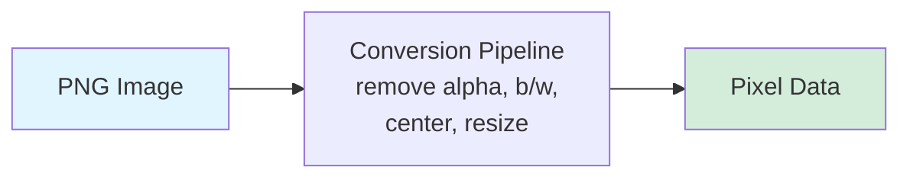
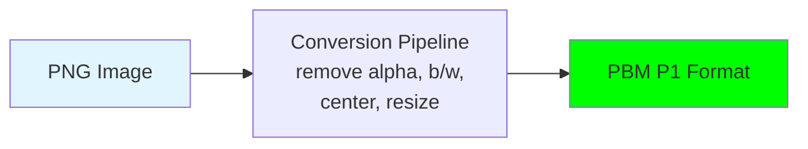
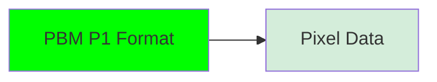

<!--
Yeah, hello everybody!
It's great having you all here today.
This is my talk. It's about rising a tiny robot with Elixir, Nerves, and AI.
And it is a story about hardware, struggle, relief, and experiences with tooling and Elixir ecosystem as a whole.
-->

---
title: "Hi, I am Carsten. 👋"
---

- Studied Computer Science, PhD in Mathematics
- 10+ years Software Consultant at TNG (consultancy originated in Munich)
- Father of two boys, 7 and 9 yo

<div class="mt-6 p-6 bg-gray-50 rounded-lg border-l-4 border-blue-500">
  <p class="italic text text-gray-700">
    Können wir selbst einen Roboter bauen?<br />
    Er soll sich bewegen können und mit mir reden!
  </p>
  <p class="text-sm text-gray-600 mt-3">— my older son 😊</p>
</div>

<!--
- I'm Carsten
- studied computer science, and did my PhD in mathematics over 10 years ago
- 2015: joined TNG, a software consultantcy with 900+ employees, founded 25 years ago in Munich, with a couple of international offices by now
- father of two boys, 7 and 9 years old
- my older son asked me a while ago: can we build a robot ourselves? The robot should be able to move and also talk to me!
- That didn’t just come out of nowhere.
-->

---
layout: section
---

# The Spark

::sectionNumber::

<tng-lightbulb />

<!--
Instead, this was a topic for us brewing up over a longer time by then.
So this is my story of how I responded.
-->

---
title: "The Spark (2020)"
---

<div class="flex items-center justify-center">
  
</div>

<!--
The whole interest of my older son in robots started a while ago.
He was always interested in technical stuff
And roughly 5 years ago, he got his first toy robot. 

This robot was cute, but not really capable.
It was able to follow you if you pressed a button on the remote and do some dances and noise that was pre-programmed.
That's it.

So the interest in this robot was lost quite quickly.
-->

---
title: "The Spark (2022)"
---

<div class="flex items-center justify-center">
  <SlidevVideo controls muted class="h-90">
    <source src="/img/Robotic Arm.mov" type="video/quicktime" />
  </SlidevVideo>
</div>

<!--
Fast forward two years, in 2022 we bought a DIY robotic arm kit with servo motors.
Well, mainly I built it but my older son was very helpful in tightening the screws. ;)
The arm was attached to a Raspberry Pi and programmed using Python.

It was fun to build and a program, but the interaction with the outside world was quite limited.
There was no speech, there was no vision.
And in order to extend its behavior, you had to program.

Not that ideal for six year-old.
-->

---
title: "The Spark (2024)"
---

<div class="flex items-center justify-center">
  
</div>

<!--
- 2024: we were at the "Deutsches Museum" in Munich
- robotics exhibition: employee went around of this unitree robotic dog
- sparked lot of interest by the visitors around, especially the kids
- expensive, nothing we could build ourselves
- But the question persisted: Can we build something smart ourselves?
-->

---
title: But Where To Get Started?
---

<div class="flex items-center justify-center">
  
</div>

<!--
- early 2025: we finally discussed building something ourselves
- every good robotics project needs a cute avatar
- my son drew something for me: a collection of robotic faces
- gave birth to the idea of the **MoodBot**, a robotics project which interacts with you and tries to "understand" the mood your are in.
- Now the only question was: where and how to get started?
-->

---
title: My Daily Tech
---

5 main clients over 10+ years, 4 different language ecosystems.

<div class="flex items-center justify-center gap-6 mt-8">
  <div class="flex flex-col items-center gap-2">
    
    <span class="text-sm text-gray-500">2015</span>
  </div>
  <span class="text-4xl text-gray-400">→</span>
  <div class="flex flex-col items-center gap-2">
    
    <span class="text-sm text-gray-500">2017</span>
  </div>
  <span class="text-4xl text-gray-400">→</span>
  <div class="flex flex-col items-center gap-2">
    
    <span class="text-sm text-gray-500">2020</span>
  </div>
  <span class="text-4xl text-gray-400">→</span>
  <div class="flex flex-col items-center gap-2">
    
    <span class="text-sm text-gray-500">2022</span>
  </div>
</div>

So... let's pick Elixir then! 😄

<!--
- obvious choices would have been an ecosystem where I am fluent in
- professional background: five clients in 10 years in four different language ecosystems
- during ruby years, learned about the existance of Elixir, and I liked it since then
- but: side from smaller side project and TNG internal workshops, I did no paided programming project using Elixir
- could have just opted it for Python and be probably OK.
- but: wanted to build something in Elixir for three main reasons
  1. I still like the language.
  2. I like the foundation it is build on: processes, message passing, GenServers---you name it.
  3. The ecosystem has grown quite a bit over time
- explore how far I can come with my part-time knowledge
-->

---
title: Vibe Away
layout: two-cols
---

<div class="flex items-center justify-center">
  
</div>

::right::

<v-click>
  <div class="flex items-center justify-center">
    
  </div>
</v-click>

<!--
- earlier this year: got confidence push I needed -> MCPs (Model Context Protocol) servers + vibe coding
- **MCPs**: let AI use hexdocs + github repos as source of truth
- **vibe coding**: describe plan, let the AI "work for me"
- was quite excited back then, and I just dove in
- feeling: "maybe I can build this!"
-->

---
title: The Fuzzy Plan
---

<div class="flex items-center justify-center">
  
</div>

<!--
- early 2025: loose idea -> use RPi from drawer, put a screen on it, let it show moods, and by speech
- but honestly: No clue about the details
- sometimes: just start, plan develops in the process
-->

---
layout: section
# sectionNumber: 2
---

# Moods On Display

::sectionNumber::

<tng-screen-device />

<!--
- start with the e-ink
- having visuals early gives good feeling of progress
-->

---
title: Nerves
layout: two-cols
---

<!-- <div class="flex flex-col items-center gap-2">
  
</div>

Craft embedded firmware with Elixir -->

- Minimal Linux → boots to BEAM
- Framework: Pre-built libraries for embedded development
- Tooling: Build, burn, deploy firmware

**Workflow:**
```shell
mix firmware
mix burn
mix upload
```

over-the-air (OTA) updates ftw!

::right::

<div class="flex flex-col items-center gap-2">
  
  <!--  -->
</div>

<!--
- nerves as foundation
- nerves: Elixir framework specifically built for embedded systems
- minimal Linux distribution that boots straight to the BEAM VM
- pre-built libraries for common embedded tasks, and tooling to build and deploy firmware
- straightforward workflow: set your target, run mix firmware to build, mix upload to deploy.
- really pleasant
-->

---
title: Pick An E-Ink Display
layout: two-cols
---

::left::

<div class="flex items-center justify-center">
  
</div>

::right::

<div class="flex items-center justify-center">
  
</div>

<!--
TODO [M] Show dislay initialization structure (GPIO, reset, hal, ...)
-->

<!--
- task: find a screen
- went with Waveshare 2.9 inch E-Ink
- why e-ink? looks cool, paper-like quality, nice aesthetics
- waveshare: existing Python library, small size
- thought would make porting to Elixir straightforward
- how hard can it be? -> it was not straightforward
-->

---
title: Vibing The Display Driver
layout: two-cols
---

::left::

**Python (Waveshare)**

```python {all|2-3|all}
def init(self):
    if (epdconfig.module_init() != 0):
        return -1

    self.reset()
    self.reset()
    self.ReadBusy()
    self.send_command(0x12)
    self.ReadBusy()

    self.send_command(0x01)
    self.send_data(0x27)
    self.send_data(0x01)
    # ... 15 more commands

    self.SetLut(self.WS_20_30)
    return 0
```

No explicit state tracking.

::right::

<v-click>

**Elixir (my port)**

```elixir
defp init_display(state) do
  with {:ok, state} <- reset_hal(state),
       {:ok, state} <- wait_idle(state),
       {:ok, state} <- send_command(state, @cmd_reset),
       {:ok, state} <- wait_idle(state),
       # ... monadic chain
       {:ok, state} <- set_lut(state, @wf_full) do

    Logger.info("Driver initialization complete")
    {:ok, state}
  end
end
```

Added GenServer + monadic error handling.

</v-click>

<!--
- described style and scope of the migration to Claude Code
- let Claude iterate on it
- imperative with implicit state management -> GenServer plus monadic chaining for improved error handling
- watching Claude providing this felt great!
- code looked clean, the error handling was explicit, seemed to make sense
-->

---
title: Great, ... Initially
---

<div class="flex flex-col items-center gap-2">
  
</div>

<!--
- for fast feedback, set up ssh mcp for Claude to execute commands on the RPi
- loop becomes: write code, deploy, test, check docs, iterate
- made vibe coding work and pleasant for me
- got me started really fast
-->

---
title: "Success. Grief. Relief."
layout: two-cols
---

::left::

Code compiled. Nothing rendered. 😭

```elixir {all|4-5}
with {:ok, state} <- reset_hal(state),
     # ... 15 initialization commands ...
     {:ok, state} <- send_data_hal(state, <<0x00>>),
     {:ok, state} <- send_data_hal(state, <<0x80>>),
     #                        wrong code 😔 ^^^^
     {:ok, state} <- set_memory_pointer(state, 0, 0),
     {:ok, state} <- set_lut(state, @wf_full) do
  # Initialized! 🥳
end
```

::right::

<div class="flex items-center justify-center">
  <div class="w-45">
    <SlidevVideo v-click controls muted>
      <source src="/img/e-ink first demo.mov" type="video/quicktime" />
    </SlidevVideo>
  </div>
</div>

<!--
- compiled it, uploaded firmware to RPi, ran display code -> **display kept blank**
- made Claude review its code and double check the implementation -> did not found the issue
- realized that I needed to manually go through the code and find the issue
- one tech friday we have, put Python code on the left and Elixir on the right -> went over the code essentially "line by line"
- found it after multi-hour search: one single hex byte
- changed it -> worked
- realization: driver part was packed with parts you need to get right, otherwise nothing works -> either to them myself or have proper guardrails in place
- lesson and reminder: break things into smaller steps, verify each piece, and actually understand what you're building
-->

---
title: "Image Pipeline: Got Ambitious"
disabled: true
---

1. flash firmware (ssh mcp)
2. run display test routine (ssh mcp)
3. capture e-ink display (camera mcp)
4. normalize camera images (opencv mcp)
5. heatmap-based comparison w/ reference image (opencv mcp)

Would be huge for e2e test text and image rendering!

<!--
So with the E-Ink display finally working, I got ambitious.

I wanted to build a proper testing setup for the image pipeline.
The idea was: render an image on the E-Ink display, photograph it with a camera, use OpenCV to compare it against the expected output, and verify everything was working correctly.

I did some research, used the Spec-Driven Workflow with Claude Code to draft a plan, even started taking measurements to 3D-print a scanning bench for the camera setup.

This diagram shows the architecture I had in mind.
Multiple MCP servers orchestrating the whole thing: SSH to control the device, Camera to capture images, OpenCV to process and compare them.
Automated end-to-end testing for the display pipeline.

It was a comprehensive plan.
And looking back... completely overengineered for what I needed at that stage.
-->

---
title: "Image Pipeline: The Plan"
---

<v-click>

on device:



</v-click>

<v-click>

Chose `image` library, based on `vix`

</v-click>

<v-switch>
<template #1>
During build, downloads precompiled binaries for macOS, while the target of is actually RPi3:

```
{:error,
 {:load_failed,
  ~c"'(...)/_build/rpi3_dev/lib/vix/priv/vix.so' (slice is not valid mach-o file)'"}}
```
</template>

<template #2>
Lucky me (just in time by end of July):


```elixir
# (mix.exs)
{:image, "~> 0.62"},
# Nerves support - precompiled artifacts #130
{:vix, git: "https://github.com/akash-akya/vix.git", branch: "master", override: true},
```
</template>

<template #3>
I get yet another error:

```shell
❯ MIX_TARGET=rpi3 mix firmware
Error happened while installing vix from precompiled binary: "missing checksum.exs file".

Attempting to compile vix from source...
Setting up precompiled libvips...

armv7-nerves-linux-gnueabihf-gcc: error: unrecognized command-line option '-flat_namespace'
```
</template>
</v-switch>

<!--
- display working -> now aim showing the robot faces
- robot faces are png -> need to convert them to pixel data for the display
- plan was: convert the images on-the-fly on device
- just for the kicks, but also for future plans
- found `vix`, wrapping libvips for image processing
- the timing was perfect - it just added Nerves support
- tried build the firmware, and... compilation errors
- tried cross-compile native dependencies from macOS to ARM Linux, and the build scripts were injecting macOS-specific flags into the Linux compiler
- tried tried forcing builds, fiddling with env vars, went down GitHub rabbit holes looking for solutions
- gave up for the moment and tried a different approach
-->


---
title: "Image Pipeline: The Build"
layout: two-cols
---

::left::

on my laptop:



<v-click>

```
P1
# A heart in 8x6 pixels
8 6
1 0 0 1 1 0 0 1
0 1 1 0 0 1 1 0
0 1 1 1 1 1 1 0
1 0 1 1 1 1 0 1
1 1 0 1 1 0 1 1
1 1 1 0 0 1 1 1
```

</v-click>

::right::

on device:

<div class="mt-5">



</div>

<div v-click class="mt-6">

```elixir
pbm
   # process chunks of eight 0s and 1s
|> Enum.chunk_every(8)
   # pack them aligned into bytes
|> Enum.map(&pack_pixels_in_byte/1)
   # finally, make it into a binary
|> :binary.list_to_bin()
```

</div>

<!--
- so I pivoted, moving the image conversion to device to my laptop
- while reusing most of the code necessary for building it on device someday
- aimed to store the pixel data in a format that easy to debug *and* is easy to parse on device
- on device: just need to read file, chunk pixel data into groups of eight, pack into bytes, and send to display
- working beats not working
- limited time -> keep it simple
-->

---
title: "Image Pipeline: The Build"
---

<div class="flex items-center justify-center">
  
</div>


---
title: Focus Recalibration
disabled: true
---

**Two Pivots:**

<div v-click="1">

**1. Workflow**
Spec-driven plans → Small verified steps
- Stopped: Writing comprehensive documentation
- Started: Build one thing, verify, move on

</div>

<div v-click="2">

**2. Scope**
Automated testing & image pipeline → Core interaction
- Dropped: Camera setup, dynamic images, test automation
- Kept: Speech in → Speech out → Mood display

</div>

<!--
At this point, I realized I needed to change how I was approaching this project.

Two pivots happened.

First, the workflow.
I had been using the Spec-Driven Development approach with Claude Code, which generated comprehensive documentation and detailed plans.
But honestly? It was slowing me down.
I was spending more time planning than building, and the plans kept getting invalidated by reality - like not being able to compile vix.

So I switched to baby-step iteration: write brief context, build one small thing, verify it works, move on.
Much faster. Much more practical.

The second pivot was the shift in scope.
For now, I dropped all the fancy features I'd planned: the automated testing setup, dynamic image generation, the whole camera verification system.
It was too ambitious for the limited time I had, and honestly, I was too focused on perfecting the display rather than getting the whole user interaction working.

Instead, I focused on the core question: can someone talk to this robot, and does it respond with emotion?
That's it. Speech in, speech out, mood display.
Everything else became nice-to-have, not must-have.

These two changes unblocked everything.
I could actually make progress again.
-->

---
layout: section
---

# Audio & AI

::sectionNumber::

<tng-microphone />

<!--
- learned some lessons the hard way
- shift approach, start simple
- refocus on core interaction: talk to robot, it responds with emotion
- next part:  bring sound and intelligence to the robot
- need to capture audio, understand what's being said, figure out the emotional tone, generate a response, and speak it back.
-->

---
title: "Audio Setup: Simple Wins"
---

Nerves for RPi3 comes with ALSA audio support. And a short test confirmed that it's working:

<v-click>
Get sound devices:
```shell
iex(1)> {output, _} = System.cmd("amixer", ["scontrols"])
{"Simple mixer control 'PCM',0\n", 0}
```
</v-click>

<v-click>
Set volume to 100%:
```shell
iex(2)> System.cmd("amixer", ["set", "PCM", "100%"])
{"Simple mixer control 'PCM', 0 ... Playback channels: Mono ...[100%] [4.00dB] [on]", ...}
```
</v-click>

<v-click>
Play a sample sound:
```shell
iex(3)> System.cmd("aplay", [Path.join(:code.priv_dir(:mood_bot), "assets/audio/sample.wav")])
```
</v-click>

<!--
- simple experiments first, then spoonfed the AI to build the full solution
- connected speakers to RPi
- quick search showed that Nerves for RPi already comes with audio (ALSA) support 
- just worked -> refreshing after vix compilation struggles
- faq: uses Elixir ports to stream audio to aplay
-->

---
title: "On-Device ML with Bumblebee"
---

Next task: **text-to-speech (TTS)**, **text generation**, and **speech-to-text (STT)**

<v-click>

**Bumblebee:** Pre-trained ML models in Elixir

</v-click>

<v-click>

<div class="flex items-center justify-center">
  
</div>

</v-click>

<!--
- with audio working -> add intelligence to the robot
- Bumblebee: go-to Elixir library to load pre-trained ML models from Hugging Face and run them directly in your Elixir application
- **No need to shell out to Python**, no separate services
- whisper for live translation, RoBERTa based model for emotion analysis, and model like Llama for text gen
-->

---
title: "Putting It All Together"
disabled: true
---

<div class="flex items-center justify-center">
  
</div>

---
title: "On-Device TTS?"
---

| What I wanted | What exists |
|---------------|-------------|
| On-device TTS | ✅ Infrastructure (Nx, Bumblebee) |
|               | ❌ TTS models <br />Early 2024: [No native TTS tools yet](https://elixirforum.com/t/are-there-any-text-to-speech-ai-tools-available-using-elixir/70047/2)<br />Late 2024: [Support requested (issue #209)](https://github.com/elixir-nx/bumblebee/issues/209) but not implemented|

Thus: go for Cloud TTS (Azure AI Speech) for now

---
title: "Small Language Models (SLMs)"
layout: two-cols
---

**Text Generation**

- Wanted: gemma-3, deepseek, qwen
- But **not supported yet** ([Bumblebee issue #423](https://github.com/elixir-nx/bumblebee/pull/423))
- Used: **SmolLM 2** (up to 1.7B) and **Llama 3.2** (1B)

<v-click at="2">

**Sentiment Analysis**

- `ChrisLalk/German-Emotions` RoBERTa model
- "Ich bin müde!" -> sentiment: sad -> 🥺

</v-click>

::right::

<v-click at="1">
  <div class="flex flex-col items-center gap-2">
    
    <p class="text-xs text-gray-500 mt-2">
      Source: <a href="https://www.stratosphereips.org/blog/2025/6/5/how-well-do-llms-perform-on-a-raspberry-pi-5" target="_blank">Stratosphere Lab - How Well Do LLMs Perform on a Raspberry Pi 5?</a>
    </p>
  </div>
</v-click>

<!--
- brief model research: what's supported by Bumblebee to date
- aimed for capable model families like Gemma or DeepSeek -- but they're not supported yet.
- nice blog posts exist out there benchmarking different models on the RPi platform
- performance = measure of quality (execution grade on real-world tasks)
- token/sec = measure of speed
- ideally: opt for top-right corner
- worked with what was available: SmolLM 2 and Llama 3
- had to ditch my RPi 3 for a new RPi 5 (16GB) to actually load and run multiple models
- sentiment analysis part: RoBERTa model: text -> scores for 8 different emotions.
-->

---
title: "Cross-Compilation Road Bump (Again)"
layout: two-cols
---

Bumblebee needs **Nx** (numerical computing) + **Tokenizers** (text -> numbers for AI).

<v-click>

**Problem:** Need these on-device (ARM Linux). Cross-compile from macOS → same issue as vix.

</v-click>

<v-click>

**Attempt:** Cross-compile from macOS to Linux ARM.

```shell
aarch64-nerves-linux-gnu-gcc: error:
  unrecognized option '-mmacosx-version-min=15.5'
```
Rust build scripts inject macOS flags into Linux compiler.

</v-click>

<v-click>

**Attempts:** Force builds, env vars, GitHub rabbit holes. Nothing worked.

</v-click>

::right::

<v-click>

**Solution:** Build VM - suggestion from [`nx_hailo` repo](https://github.com/vittoriabitton/nx_hailo).

<div class="flex items-center justify-center">
  
</div>

</v-click>

<!--
Bumblebee with two key dependencies:

**Nx**: The numerical computing library that actually runs the ML models - handles tensors, matrix operations, all the mathematical heavy lifting

**Tokenizers**: Elixir bindings for Hugging Face's Rust-based tokenizers. convert text into numerical representations models can understand

- ran into same problem as as with vix: cross-compilation issues
- Rust build scripts injecting macOS-specific compiler flags - things like "mmacosx-version-min" - into what should have been a Linux build
- tried adjusting environment variables, forcing clean builds, searching GitHub issues
- but now instead of sub-minute rebuilds, I have 15ish minutes builds
- quick iteration cycle gone for the moment
-->

---
title: "Whisper: Speech-To-Text"
layout: two-cols
---

::left::

**Streaming Audio Pipeline**

```elixir {all|1-5|6-8|9-12|all}
child(:mic, %Membrane.PortAudio.Source{
  sample_format: :s16le,
  sample_rate: 16_000,
  channels: 1
})
|> child(:whisper, %WhisperSink{
  serving: whisper_serving,
  callback_pid: manager_pid
})
```

::right::

<v-click>

**Whisper Transcription**

```elixir {hide|all|3-5|7-9|10-14}
# Read & convert audio
{:ok, raw_data} = File.read(file_path)

samples = for <<sample::signed-little-16 <- raw_data>>,
  do: sample / 32768.0

# Transcribe via Bumblebee
tensor = Nx.tensor(samples, type: :f32)
result = Nx.Serving.batched_run(WhisperServing, tensor)

text =
  result.chunks
  |> Enum.map(& &1.text)
  |> Enum.join("")
```

</v-click>

<!--
- needed to capture audio from a mic so the robot could listen
- **membrane** framework for audio pipeline because the plugin ecosystem is really rich
- PortAudio captures from the microphone in 16kHz mono with the sampling setting expected by Whisper
- Whisper otherwise internally converts it to this format anyway
- elegant binary pattern matching: converting signed 16-bit little-endian samples into normalized floats in one line
- create an Nx tensor (like multi-dimensional array for ML ops) from those normalized samples
- pass tensor to Bumblebee serving, Whisper processes it, returns chunks of transcribed text
-->

---
title: "Push The Button"
layout: two-cols
---

Missing link: How to **start/stop** the audio pipleline?

::left::

<div class="flex items-center justify-center">
  
</div>

::right::

<div class="flex items-center justify-center">
  
</div>

<!--
So I had audio capture working, but I needed a way to trigger it.
The robot needed to know when to start listening.

The answer was simple: a physical button.
Press it once to start recording, press it again to stop.

But before I integrated a button with the Raspberry Pi and all the firmware, I wanted to test the concept first.

So my son built this little Arduino test circuit - I just assisted.
Just a button and an LED - press the button, the LED toggles on and off.
Super simple, but it let us verify the hardware worked and understand the interaction.

He got to see how a button press triggers an action, and I got to make sure I understood the GPIO setup before bringing it into the actual project.

This is something I learned through all these challenges: test components independently first.
Don't try to integrate everything at once.
When something breaks - and something will break - you want to know which part is the problem.

Plus, building this together with my son was fun.
Learning together beats learning alone.
-->

---
title: "Putting It All Together"
---

<div class="flex items-center justify-center">
  <SlidevVideo controls muted class="h-100">
    <source src="/img/moodbot-full-pipeline.mov" type="video/quicktime" />
  </SlidevVideo>
</div>

---
layout: section
---

# Wrap Up

::sectionNumber::

<tng-notepad />

<!--
So that's MoodBot. A working interactive robot built with Elixir and Nerves.

Let me wrap up with some reflections on what worked, what didn't, and what this experience taught me about the Elixir ecosystem for hardware projects.
-->

---
title: "Wrap Up"
---

**What worked well:**
- Membrane, Bumblebee, Nerves tooling are a blast to work with
- Elixir's supervision + binary handling made this look easy

**What's still rough:**
- Cross-compilation for native libs (vix, tokenizers)
- Limited model selection in Bumblebee
- No on-device TTS yet

<!--
So let me summarize what I built and what I learned.

I built a robot that can listen to speech, understand the emotional tone, display a mood on an E-Ink screen, and generate spoken responses.
All running on a Raspberry Pi with Nerves.

What worked well?
Membrane for audio processing is solid. Really nice to work with.
Bumblebee makes running ML models on-device straightforward once you get past the compilation.
And Nerves as a platform - the tooling, the development experience - it's mature and reliable.

What's still rough?
Cross-compilation for libraries with native dependencies like vix and Nx - that's painful from macOS.
Model selection in Bumblebee is limited. You work with what's supported.
And there's no on-device TTS support yet.

The ecosystem got me far enough to build something that works.
There were plenty of rough edges, but I got there.

And building this with my son made it worthwhile.
-->

---
layout: speaker
# image: ""
---
